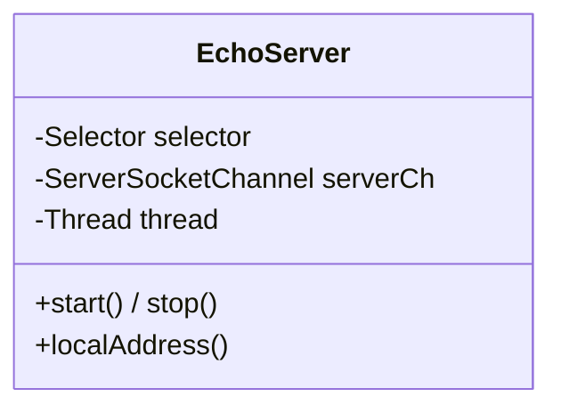

# S02 · 学习者讲义:NIO / 并发热身

> **教学法**(给人看)。**执行约束以 `specs/sessions/S02-nio-warmup.md`(执行规格)为准**。Phase 0 · 前置基础。

## 教学目标
- 用纯 JDK NIO 写一个**单线程 Selector echo server**
- 复习并发(线程池 / Future / 锁)

## 核心概念与设计
```
              ┌── Selector 主循环 ──┐
   新连接 ───►│ select() → 遍历 ready keys │
              │  OP_ACCEPT → accept → register(OP_READ) │
              │  OP_READ    → read(buf) → channel.write(buf)(echo) │
              └────────────────────┘
```
- **`Selector` / `Channel` / `ByteBuffer`**:NIO 三件套。
- **`interestOps`**:`OP_ACCEPT` / `OP_READ` / `OP_WRITE`,`select()` 返回就绪 key。

## 核心类设计与架构
> 热身用一个类搞定;S3 会把它拆成 NioServer/NioSession/FrameCodec。



| 类 | 职责 | 设计意图 |
|---|---|---|
| `EchoServer` | 单线程 Selector echo:accept→register(OP_READ);read→write 回显 | 热身极简,一个类包揽;生产版(S3)会按职责拆分 |

## 关键原理(为什么)
- **为什么 NIO 而非 `java.io`**:一个线程管多连接(Selector 复用),为 S3 多 worker 打基础。
- **为什么先单线程**:吃透主循环 + 会话;并发留 S3。

## 常见陷阱
- **`ByteBuffer` 的 `flip()`**:写→读要 flip(把 limit 设为当前位置、position 归零)。
- **`OP_WRITE` 常开烧 CPU**:几乎总是就绪,常开让 `select` 空转(留 S3 的 pull-based 解法)。

## 自测题(你真的懂了吗)
1. `Selector` 一个线程怎么管多个连接?
2. `ByteBuffer` 读写模式怎么切换?
3. echo server 收到"半条消息"会怎样?(→ 引出 S3 的长度前缀帧)

## 与 Ignite 对照
看 `vendors/ignite/internal/util/nio/GridNioServer.java` 的目标形态(多 worker + 过滤链 + recovery)——本 session 只是**热身**,不实现那些。
