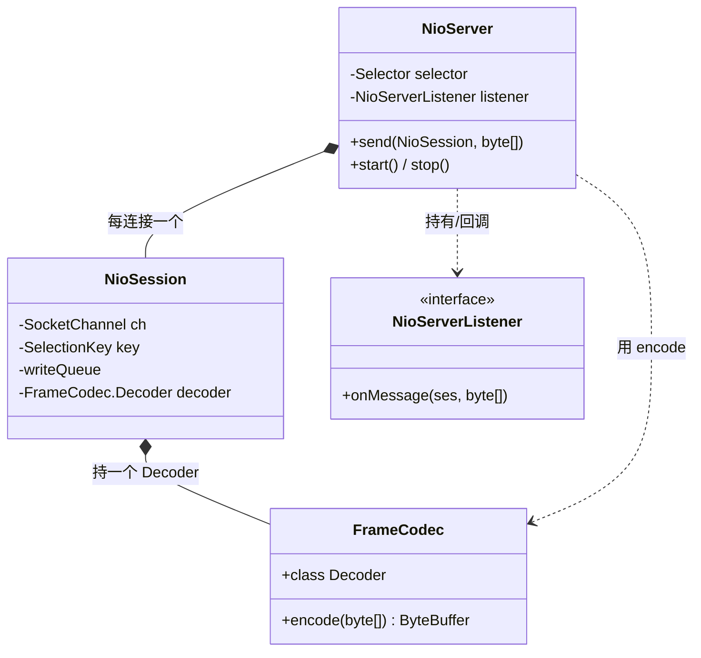

# S03 · 学习者讲义:NIO 引擎 v1(单 worker + 会话 + 长度前缀帧)

> **教学法**(给人看)。**执行约束以 `specs/sessions/S03-nio-engine.md`(执行规格)为准**;本讲义不影响 AI 执行。
> Phase 1 · NIO · v1。

## 教学目标
学完本 Session,你应当能够:
- 用纯 JDK NIO 手写一个**单 selector worker** 的异步服务器(accept + read + write 主循环)
- 实现 `GridNioSession` 等价的会话对象(每连接读写缓冲 + meta)
- 实现**长度前缀帧**(4 字节大端长度 + 载荷),正确处理粘包/半包
- 讲清 Ignite 为什么用"**pull-based 写 + OP_WRITE 按需开**",而不是"`send` 直接写 socket"

## 核心概念与设计
```
                 ┌──────────── NioServer(单 worker)────────────┐
   新连接 ─accept─►│  Selector 主循环:select → 遍历 ready keys    │
                 │   isAcceptable → accept → register(OP_READ)  │
                 │   isReadable   → read(ses)  → FrameCodec → listener.onMessage
                 │   isWritable   → write(ses) → channel.write  │
                 └──────────────────────────────────────────────┘
   任意线程: ses.send(msg) ──► 入 ses.queue + 置 needWrite + selector.wakeup()
                                          (pull-based:不直接写 socket)
```
- **单 selector worker 模型**:一个线程 + 一个 `Selector`,所有已连接会话注册在它上面。(Ignite 用单独的 `GridNioAcceptWorker` 做 accept,v1 可简化为同一 worker。)
- **`NioSession`**:每连接一个会话对象,持有读写缓冲、meta(数组,非 Map)、关闭状态。**同一会话的所有 IO 由其 owning worker 线程串行处理 → 该会话内无锁**。
- **长度前缀帧**:每条消息 = `[4 字节大端长度][载荷]`;接收侧维护"先凑齐 4 字节长度 → 再按长度凑齐载荷"状态机。
- **pull-based 写**:`send(msg)` 只入队 + 标记需要写;真正 `channel.write` 在 worker 线程、由 `OP_WRITE` 就绪驱动。

## 核心类设计与架构



| 类 | 职责 | 设计意图(为什么单独成类) |
|---|---|---|
| `NioServer` | 单 worker 主循环(accept+read+write)+ 生命周期 + 对外 `send` | 集中"一个线程管所有连接"的 NIO 逻辑(v2 会拆出 accept / worker) |
| `NioSession` | 单连接状态(写队列 + 帧解码器 + meta) | 每连接一份有状态(解码器跨 read 保留半包);会话内串行无锁 |
| `FrameCodec`(+`Decoder`) | 长度前缀帧编解码(无状态 encode / 有状态 Decoder) | 编解码与 IO 分离;Decoder 有状态,故内聚成类、每会话一个 |
| `NioServerListener` | 业务回调契约(`onMessage` 等) | 消费者(下游)只依赖此接口,不耦合 NIO 内部 |

## 关键原理(为什么)
- **为什么单 worker 先做**:隔离并发复杂度,先把"selector 主循环 + 会话 + 帧"吃透;多 worker 是 S4 的增量。
- **为什么写是 pull-based(`send0` 不直接写)**:
  ① 保证 channel 只被 owning worker 线程访问(线程安全,免加锁);
  ② OS 通过 `buf.remaining()>0` 自然背压(socket 缓冲满时 write 返回 < remaining);
  ③ 可用 `procWrite` CAS 合并多次 `send` 为一次 worker 唤醒。
- **长度前缀如何解决粘包/半包**(小演算):
  发送 `[00 00 00 05][H E L L O][00 00 00 03][A B C]`;接收可能一次到 `[00 00 00 05][HELLO][00 00]`(第三条长度只到一半)或两条粘在一次 read 里。
  状态机:**① 凑齐 4 字节长度 → ② 按长度凑齐载荷 → ③ 切出一条消息 → ④ 继续循环**。参 Ignite `GridNioServerBuffer.read()`。

## 常见陷阱
- **`OP_WRITE` 常开会烧 CPU**:几乎总是就绪,常开让 `select` 空转。**只在队列非空时开、写空就关**。
- **粘包/半包**:别假设"一次 read = 一条消息";必须用状态机帧解码器。
- **跨线程访问 channel**:`send` 可能在非 worker 线程调用——**千万别在那直接 `channel.write`**;只入队 + `wakeup`。
- **DirectByteBuffer vs heap**:v1 用 heap 即可;direct 留到性能优化。

## 自测题(你真的懂了吗)
1. 为什么 `send` 不能直接 `channel.write`?
2. `OP_WRITE` 为什么要按需开关?
3. 长度前缀相比分隔符帧,优劣各是什么?
4. 单 worker 的瓶颈在哪?(→ 引出 S4 多 worker)

## 与 Ignite 对照
同等 echo 负载下对比你的 v1 与 Ignite 单连接的吞吐/延迟。差距主要来自:Ignite 用 direct 模式 + `SelectedSelectionKeySet` 反射优化 + 多 worker——**这些正是 S4/S5 要补的**。
