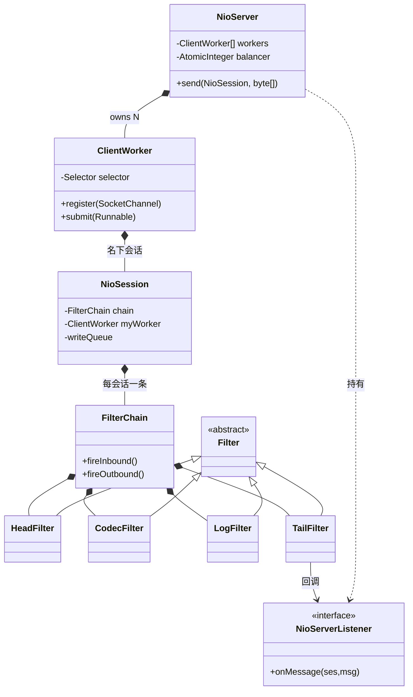

# S04 · 学习者讲义:NIO 引擎 v2(多 worker + 过滤链)

> **教学法**(给人看)。**执行约束以 `specs/sessions/S04-nio-v2.md`(执行规格)为准**。
> Phase 1 · NIO · v2。从 `s03-nio-engine` 复制扩展。

## 教学目标
学完本 Session,你应当能够:
- 把 v1 的单 worker 拆成 **1 个 AcceptWorker + N 个 ClientWorker**(各一个 Selector),并用 **Balancer** 把新会话分配给某个 worker
- 实现一条**双向过滤链**(`HeadFilter ← filters ← TailFilter`),让"编解码 / 日志 / SSL / 追踪"成为可插拔层
- 讲清两个关键不变量:**同一会话只属于一个 worker**(会话内无锁);**`OP_WRITE`/注册必须在 owning worker 线程做**

## 核心概念与设计
### 多 worker 模型
```
                    ┌─ AcceptWorker(1 线程,独占 Selector,只 accept)
新连接 ─accept─►    │   选 worker = Balancer.roundRobin() ──投递"注册请求"──► ClientWorker[k]
                    └─ ClientWorker[0..N-1]:各独占一个 Selector,跑自己会话的 read+write
```
- **AcceptWorker** 只 accept,然后把新 channel 包装成"注册请求"投递给某 **ClientWorker**(在**该 worker 线程**完成 `register(OP_READ)` + 建 session)。
- **不变量**:一个会话绑定唯一 worker,read/write 全在该 worker 线程串行 → **会话内无锁**;并发只在**跨会话**间。

### 过滤链(双向)
```
入站 (wire → app):  bytes ─► [HeadFilter] ─► [CodecFilter] ─► [LogFilter] ─► [TailFilter] ─► listener.onMessage
出站 (app → wire):  listener.send ─► [TailFilter] ─► [LogFilter] ─► [CodecFilter] ─► [HeadFilter] ─► 写队列 ─► worker OP_WRITE
```
- `HeadFilter`:wire 一侧,**入站起点 / 出站终点**(出站把消息落进写队列)。
- `TailFilter`:app 一侧,**入站终点**(→ listener)、**出站起点**(`send` 进入链)。
- 每个 `NioSession` 持自己的链(v1 的直连 listener 被链取代)。

## 核心类设计与架构
> 类怎么组合(图)+ 为什么这么切(表)。



| 类 | 职责 | 设计意图(为什么单独成类) |
|---|---|---|
| `NioServer` | 生命周期 + accept 派发 + 对外 `send` | 把"接生(accept)"与"养(read/write)"分离;accept 线程不背读写负载 |
| `ClientWorker` | 单 selector 循环 + 名下会话的 read/write | 保证"会话内单线程无锁"不变量;N 个 worker 并行 |
| `NioSession` | 单连接状态(链 + 所属 worker + 写队列) | 每连接一份有状态(过滤链 / codec 解码器独享);会话内串行 |
| `FilterChain` | 双向链接过滤器 + 分发 | 把"协议/日志/SSL"从 IO 主循环解耦成可插拔层 |
| `Filter`(抽象) | 过滤器契约(双向 on / proceed) | 统一所有过滤器接口,链里任意插拔 |
| `HeadFilter` / `TailFilter` | 链端点(wire 侧入队 / app 侧回调) | 把"网络 IO 终点"与"业务回调"固定在两端,中间过滤器可任意组合 |
| `NioServerListener` | 业务回调契约(`onMessage` 等) | 消费者(下游 S20)只依赖此接口,不耦合 NIO 内部 |

## 关键原理(为什么)
- **为什么多 worker**:单 worker 在连接多 / read 重时成瓶颈;多 worker 让 IO 并行,而"每会话绑一个 worker"保留**会话内单线程无锁**——并发在会话之间,不在会话之内。
- **为什么过滤链**:把"编解码 / 日志 / SSL / 追踪"从主循环解耦成**可插拔层**;**双向**语义让入站(解码、解密)和出站(编码、加密)都能被过滤。
- **为什么 send 要路由到 owning worker**(多 worker 新增难点):`SelectionKey.interestOps` 非线程安全,`OP_WRITE` 开关、channel 写都**必须在 owning worker 线程**。故 `send` 入队后要 wake **该会话的** worker(会话记住 `myWorker`)。
- **为什么注册也在 worker 线程**:`SocketChannel.register(selector,…)` 必须对着该 worker 的 selector;accept 后"投递注册请求"给目标 worker,由它在自己线程注册。

## 常见陷阱
- **在错误线程注册 channel / 改 interestOps**:都必须在 owning worker 线程;accept 线程别直接注册。
- **send wake 错 worker**:OP_WRITE 永远不被处理 → 消息卡队列。必须 `ses.myWorker().wakeup()`。
- **过滤链顺序错了**:codec 必须在"靠 wire"侧(先把字节变消息);反了上层拿到 `ByteBuffer` 而非业务消息。
- **过滤器阻塞 NIO 线程**:inbound 过滤器别做慢 IO;Ignite 用 `GridNioAsyncNotifyFilter` 把 listener offload 到线程池(v2 可选)。

## 自测题(你真的懂了吗)
1. 为什么同一会话不能被两个 worker 同时处理?
2. `send` 为什么要 wake **owning** worker 而非任意 worker?
3. 过滤链为什么是**双向**的?只做单向会丢什么能力?
4. 想加"统计每连接字节量"的过滤器,插在链的哪一侧、哪个位置?

## 与 Ignite 对照
Ignite `offerBalanced` 支持轮询与"奇偶读/写分离";过滤链常装 `CodecFilter(GridDirectParser)` + `ConnectionBytesVerifyFilter` + 可选 `SslFilter`/`TracerFilter`。差距:Ignite 还有 **session 迁移(MOVE)** 跨 worker 负载均衡(`SizeBasedBalancer` 在 accept 线程跑)——留作选做。
