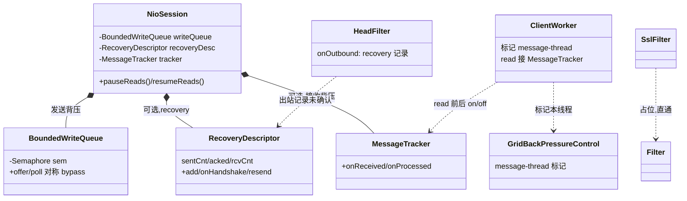
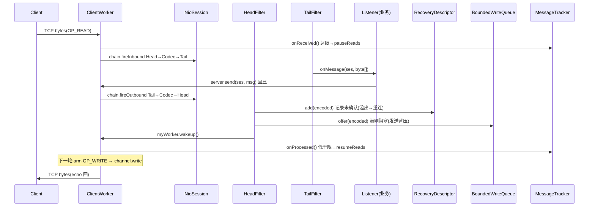

# S05 · 学习者讲义:NIO 引擎 v3(recovery + 背压 + SSL 槽)

> **教学法**(给人看)。**执行约束以 `specs/sessions/S05-nio-v3.md`(执行规格)为准**。
> Phase 1 · NIO · v3(Phase 1 收官)。

## 教学目标
学完本 Session,你应当能够:
- 实现 recovery:用**单调计数器**做断线重连后的"不丢不重"(而非 per-message 去重集)
- 实现**双重背压**:发送端(有界队列 + 信号量)+ 接收端(`MessageTracker` 暂停/恢复 `OP_READ`)
- 讲清为什么 worker 线程发送时要**旁路信号量**(防自死锁),以及 `poll` 时如何**对称释放**

## 核心概念与设计
### Recovery(计数器去重)
- 每 connection 一个 `RecoveryDescriptor`:`sentCnt`(已发)/ `acked`(对方已确认)/ `rcvCnt`(我已收)+ 有界 `unacked` 队列。
- 发送:`add(encoded)` 计入未确认;溢出 → 关连接触发重连。
- 重连握手:对方回告"已收到我方 N 条" → `onHandshake(N)` 对齐(丢弃已确认),剩余 `unacked` 重发。
- 接收方把 `rcvCnt` 在握手里回告 → 发送方据此对齐 → **天然去重,无需 per-message 集合**。

### 双重背压
- **发送端**:`BoundedWriteQueue`(有界 + Semaphore)。队列满 → 生产者 `acquire` 阻塞;worker 写出 → `release`。
- **接收端**:`MessageTracker`(在途计数)。达上限 → `pauseReads`(关 `OP_READ`,让对端别再灌);处理完 → `resumeReads`。
- **message-thread 旁路**:worker 线程(处理消息时)发送,跳过信号量;`poll` 时对跳过的项也跳过 release —— **对称**,无 permit 泄漏、无死锁。

### SSL 槽
`SslFilter` 占位(直通);真实实现需 `SSLEngine` + 握手 + `unwrap`/`wrap`,留后续。

## 核心类设计与架构
> v3 在 v2(NioServer/ClientWorker/FilterChain/filters)基础上新增 recovery + 双背压;下图聚焦 **v3 新增/变化**的类与关系。

| 类(v3 新增 / 变化) | 职责 | 设计意图(为什么这么切) |
|---|---|---|
| `NioSession`(v3) | 写队列改 `BoundedWriteQueue`;加可选 `RecoveryDescriptor`/`MessageTracker` + pause/resume | 背压/recovery 状态天然属于"单连接",挂在会话上 |
| `HeadFilter`(v3) | 出站时若启用 recovery 记录未确认;溢出 → 触发重连 | recovery 记录发生在"消息即将上 wire"那一刻,HeadFilter 是唯一终结点 |
| `ClientWorker`(v3) | 启动标记 message-thread;read 接 MessageTracker;write 用 pollFuture 释放信号量 | worker 是"消息处理线程",旁路 + tracker 接入都集中在它 |
| `RecoveryDescriptor` | 每 connection 计数器 + 有界未确认队列 + resend/release | "断线重连重发"状态封装成独立对象,S20 拥有并接入 |
| `BoundedWriteQueue` | 有界队列 + 信号量 + 对称 bypass | 发送背压逻辑内聚,与 worker/session 解耦 |
| `MessageTracker` | 在途计数 + 达限 pause / 低于限 resume | 接收背压独立成类,回调式(PauseResume)接入便于测试 |
| `GridBackPressureControl` | ThreadLocal 标记 message-thread | 旁路信号量的判据;极简独立,便于复用 |
| `SslFilter` | SSL 占位(直通) | 预留链位置;真实实现需 SSLEngine |

## 核心链路
> echo 往返 + **v3 新增的 recovery/背压接入点**(在 S04 流程上插入 `MessageTracker`/`RecoveryDescriptor`/`BoundedWriteQueue`)。

## 关键原理(为什么)
- **为什么用计数器而非 per-message 去重集**:重连时双方用"已收数"对齐,天然只重发缺失的;无需存"已见消息"集合(省内存、O(1))。小演算:发 m1,m2,m3;对方收到 m1,m2(rcvCnt=2);断线;握手对方说"我收到 2" → 发送方丢 m1,m2,重发 m3;对方收 m3 → 共 m1,m2,m3,**无重复**。
- **为什么需要两套背压**:发送端防"本端写爆"(队列无界会 OOM);接收端防"对端灌爆"(本端来不及处理)。只做一侧,另一侧失控。
- **为什么 worker 线程要旁路信号量**:worker 既"处理消息"又"排空写队列";若它发回复时 `acquire` 阻塞在满队列上、而队列只能由它自己排空 → **死锁**。旁路 + 对称释放破解。
- **为什么溢出要重连**:未确认队列溢出 = 对端长时间不 ack(可能已僵死);关连接重连,靠握手重新对齐,是 Ignite 的自愈策略。

## 常见陷阱
- **permit 泄漏/死锁**:`offer` 旁路但 `poll` 不旁路(或反之)→ 信号量错账。必须**对称**(本实现用 `Node.bypass` 标记)。
- **pause 后忘 resume**:`MessageTracker` 必须在"处理完成"回调里 decrement,否则永久暂停读。
- **溢出处理**:`add` 返回 false 时要真的触发重连(关连接),别只记日志。
- **计数器溢出**:`long` 单调递增,实际不会溢出;学习版忽略。

## 自测题(你真的懂了吗)
1. 为什么 recovery 不需要 per-message 去重集合?
2. 只有发送端背压、没有接收端背压,会出什么问题?
3. worker 线程发送时若不旁路信号量,会怎样?
4. 断线后重发,m1/m2 会不会被重复投递?为什么?

## 与 Ignite 对照
Ignite 的 recovery 由 **SPI(`GridNioServerWrapper`)** 拥有:维护 `recoveryDescs`,handshake 时交换 rcvCnt,把 descriptor 经 session meta 接入,`REGISTER` 时 `resend`。我们这层只提供**机制 API**;handshake/重连编排归 S20(Communication)。Ignite 还有 slow-client 策略(消费者侧踢慢节点)、session 跨 worker 迁移(MOVE)——本 session 不做。
