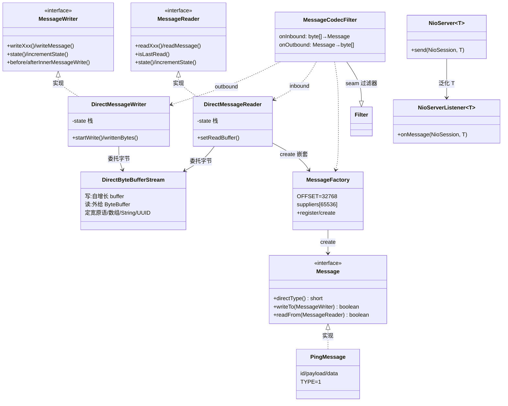
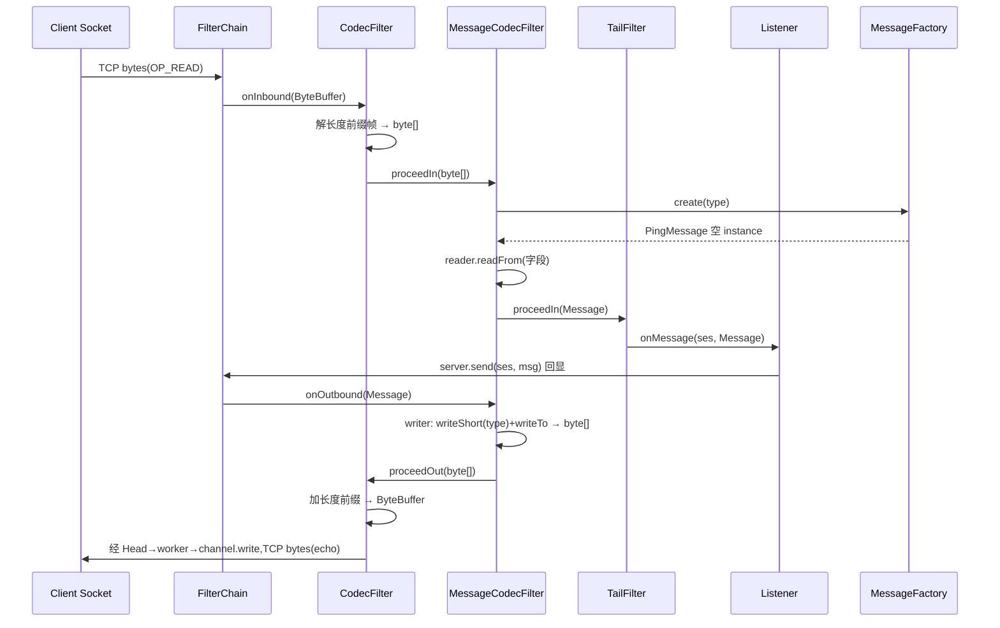

# S06 · 学习者讲义:Direct 消息编解码 v1

> **教学法**(给人看)。**执行约束以 `specs/sessions/S06-direct-codec.md`(执行规格)为准**。
> Phase 2 · Direct + Marshaller · v1。

## 教学目标
学完本 Session,你应当能够:
- 把 NIO 层的 `byte[]` 载荷升级为**结构化 `Message`**:手写 `writeTo`/`readFrom`,按固定字段顺序、自描述地读写(无线上类描述符)
- 实现 **2 字节 `directType` 注册表**(`MessageFactory`):`+32768` 数组下标、O(1) 查询、白名单(只注册过的 type 能构造)
- 把 Direct 编解码**叠到 Phase 1 NioServer 的过滤链上**(`MessageCodecFilter` seam),并把 `NioServer`/`Listener` **泛化 `<T>`**
- 讲清 **Direct(固定协议消息)与 Marshaller(任意用户对象,S7)的分工**——以及它们在 `GridIoManager` 以 `byte[]` 字段 seam 汇合

## 核心概念与设计
### Message:每条消息自己声明字段
- `Message` 接口:`short directType()`(类型 ID)+ `writeTo(MessageWriter)` + `readFrom(MessageReader)`。字段顺序与类型在**编译期固定**,运行期只按序读写 —— 与 Java 序列化的根本区别:**无线上类描述符、无反射**(故更紧凑、更快、也更安全)。
- **v1 wire 格式**:一条消息在线上 = `[2字节 directType][字段1][字段2]…`。`writeTo`/`readFrom` **只处理字段**,type 由上层写一次:顶层消息由 `MessageCodecFilter` 写,嵌套消息由 `writeMessage`/`readMessage` 写。

### 类型注册表 MessageFactory
- `register(short, Supplier)` / `create(short)`。short 范围 `[-32768, 32767]`,加 `OFFSET=32768` 映射到 `[0, 65535]` 的**数组下标** → O(1)、无反射、无 Map。负 type 合法(Ignite 的 `NODE_ID=-1`、`HANDSHAKE=-3`)。
- **注册期可写,建成后只读**:建成后 `register` 抛异常(运行期不改);`create` 未知 type 抛异常 —— 即**白名单**(只有注册过的 type 能构造,天然防"任意类反序列化")。

### 字段读写:DirectByteBufferStream + Writer/Reader facade
- `DirectByteBufferStream`(字节引擎):定宽原语(byte/short/int/long/boolean)+ 长度前缀数组(byte[]/int[]/long[])+ UTF-8 String + present-flag UUID + 嵌套 Message。写侧自增长 buffer、读侧外给 ByteBuffer。
- `DirectMessageWriter`/`DirectMessageReader`:薄 facade,委托 stream;额外管 ① `state` 字段游标(消息的 `switch(state)` 用)② 嵌套消息读写的 **state 栈**(子消息要独占 state=0)。
- v1 由 NIO 层(`FrameCodec`)保证一次给到**完整消息**,故读总一次过(无 partial-read 续读)。

### seam + 泛化
- `MessageCodecFilter extends Filter`(nio 包):inbound `byte[]→Message`(读 type→create→readFrom),outbound `Message→byte[]`(writeShort(type)+writeTo)。叠在 `CodecFilter`(长度前缀帧)之上。
- `NioServer<T>` / `NioServerListener<T>`:从 Phase 1 的硬编码 `byte[]` 泛化为 `<T>` —— 让结构化 `Message` 流经 NioServer。

## 核心类设计与架构
> 图聚焦 S6 新增的 direct 包 + seam,与 nio 包的变化。

| 类(S6 新增 / 变化) | 职责 | 设计意图(为什么这么切) |
|---|---|---|
| `Message` | 协议消息根接口:directType + writeTo/readFrom | 字段顺序编译期固定 → 无类描述符/无反射,紧凑+安全 |
| `MessageWriter`/`MessageReader` | 字段读写契约 + state 游标 + 嵌套钩子 | 把"字节怎么放"与"消息有哪些字段"解耦,reader/writer 可换实现 |
| `DirectByteBufferStream` | 字节引擎(定宽原语/数组/String/UUID/Message) | 纯字节层独立,writer/reader 只做 facade + state |
| `DirectMessageWriter`/`DirectMessageReader` | facade:委托 stream + 管 state 栈 | state 栈让嵌套消息各占独立字段游标 |
| `MessageFactory` | type↔工厂注册表(+32768 数组) | O(1)+白名单;负 type 合法 |
| `PingMessage` | demo 消息(照 GridIoMessage 写) | 用最小例子示范"手写消息"的标准范式 |
| `MessageCodecFilter` | seam:byte[]↔Message | 把 Direct 编解码插进 NioServer 过滤链(S20 复用) |
| `NioServer<T>`/`NioServerListener<T>` | 泛化消息类型 | 从 byte[] 升级到结构化 Message,且兼容 Phase 1 的 byte[] echo |

## 核心链路
> PingMessage 经 NioServer(链:Head→CodecFilter→MessageCodecFilter→Tail)的往返。client 用 raw Socket 按同样格式编解码。

## 关键原理(为什么)
- **为什么 2 字节 type + 数组注册表(而非 Map/反射)**:数组下标查询 O(1)、无装箱、无反射;`create` 只认注册过的 type(白名单)→ 防"对端塞一个任意类反序列化"的安全洞(Java 原生反序列化的经典坑)。`+32768` 偏移让 short 的负值也能做合法下标 —— Ignite 正是用负 type 给控制消息(`NODE_ID=-1`、`HANDSHAKE=-3`)。
- **为什么自描述字段流(而非 Java 序列化或长度前缀 byte[])**:字段顺序编译期固定,线上**只传值、不传类描述符**。小演算:`PingMessage{id=7, payload="hi", data=[1,2,3]}` → `[00 01][8字节 long][len+UTF8 "hi"][len=3 + 3字节]`;Java 序列化还要写类描述符/handle/serialVersionUID 等,体积大几倍且不可跨语言。
- **为什么 state 计数器 + 嵌套 state 栈**:消息的 `switch(state)` 让"读到/写到哪个字段"成为可恢复状态(Ignite 据此跨 partial-read 续读)。**嵌套消息要独占 state=0**,故进/出子消息时 `beforeInnerMessageWrite` 压栈存父 state、`afterInnerMessageWrite` 弹栈恢复。v1 由 `FrameCodec` 保证消息完整,故 state 机总一次走完;但协议形态保留(对照 Ignite 1:1)。
- **为什么 Direct 与 Marshaller 分工**:Direct 处理**固定、编译期已知形状**的协议消息(信封),Marshaller 处理**任意、运行期才知形状**的用户对象(载荷)。二者在 `GridIoManager` 以 `writeByteArray` 字段 seam 汇合:Marshaller 把对象编成 `byte[]`,搭进 Direct 信封。⇒ 各自独立演化、独立测试,这也是 Phase 2 拆 S6/S7 的依据。

## 常见陷阱
- **嵌套消息忘用 state 栈**:子消息的 `switch(state)` 会从**父消息的 state** 继续 → 读/写错字段。必须 `beforeInnerMessageWrite`/`afterInnerMessageWrite`(及读侧对应)包裹 `child.writeTo/readFrom`。
- **`+32768` shift 漏掉**:short 直接做数组下标 → 负 type `ArrayIndexOutOfBounds`。必须 `directType + OFFSET`。
- **type 该谁写易混淆**:v1 的规矩是 `writeTo`/`readFrom` **只管字段**,type 由上层写(顶层 `MessageCodecFilter`、嵌套 `writeMessage`/`readMessage`)。两边都遵循 `[type][字段]`,不要双层都写或都不写。
- **null 标记别混**:嵌套 `Message` null = `Short.MIN_VALUE`;数组/String null = 长度 `-1`;UUID null = present 标志 `0`。三种 null 编码不同。
- **注册表建成后改**:`initialized()` 后再 `register` 抛异常 —— 注册在启动期一次性完成,运行期只读(线程安全)。

## 自测题(你真的懂了吗)
1. `MessageFactory` 为什么用 `+32768` 数组下标而不是 `Map<Short, Supplier>`?
2. `PingMessage.writeTo` 里**不写** `directType`,那 type 由谁写?嵌套消息的 type 呢?
3. 嵌套消息读写时,如果不压/弹 state 栈,会出现什么错误?用一个具体例子说明。
4. Direct 编解码和(将在 S7 实现的)Marshaller 各负责什么?它们在哪一层、以什么形式汇合?
5. 为什么 `MessageFactory.create` 对未知 type 抛异常,而不是返回 null?(提示:安全)

## 与 Ignite 对照
**做了(对齐 Ignite 机制)**:
- `Message` 接口 + 手写 `writeTo`/`readFrom`(`switch(state)` 贯穿,照 `GridIoMessage` 写);
- 2 字节 `directType` + `MessageFactory`(`+32768` 数组、建成后只读、白名单 `create`);
- `DirectByteBufferStream`(定宽原语/数组/String/UUID/嵌套 Message)+ Writer/Reader facade + state 栈;
- `MessageCodecFilter` seam(叠 `CodecFilter` 帧)+ `NioServer<T>`/`Listener<T>` 泛化。

**不做/简化(详见 `specs/deferred.md` Phase 2)**:
- codegen `MessageSerializer` + `@Order` 注解处理器(Ignite 2.18.0 现代写法,编译期生成等价状态机;v1 手写);
- varint+zigzag 编码 int/long(Ignite 用 base-128 varint 让小数值省字节;v1 定宽);
- **跨 partial-read 的 resume 状态机**(`DirectByteBufferStream` 的 `tmpArrOff`/`arrOff`/`uuidState` 等逐字段游标;v1 由 `FrameCodec` 保证完整消息,不需要);
- `CacheObject`/`KeyCacheObject`/`AffinityTopologyVersion` Direct 字段类型(Ignite 把 `internal/direct` 向上耦合到 cache 子系统;v1 裁剪,只支持原语/数组/String/UUID/Message);
- `Collection`/`Map` Direct 字段(v1 只原语数组);
- `MessageFormatter` SPI(多 reader/writer 切换;v1 单一);
- Ignite 的 `writeHeader`/`isHeaderWritten` 机制(v1 把 type 统一交给上层写,简化掉这层历史包袱)。

> 另:Ignite 2.18.0 已把 **Marshaller** 迁到 `modules/binary/{api,impl}`(默认是 BinaryObject,不是 Optimized)。本 session 只做 Direct;Marshaller 在 S7(学习版仍按经典 SPI+Optimized 形态放 `learning/internal/marshaller/`,见 P02 §1 现实校准)。
