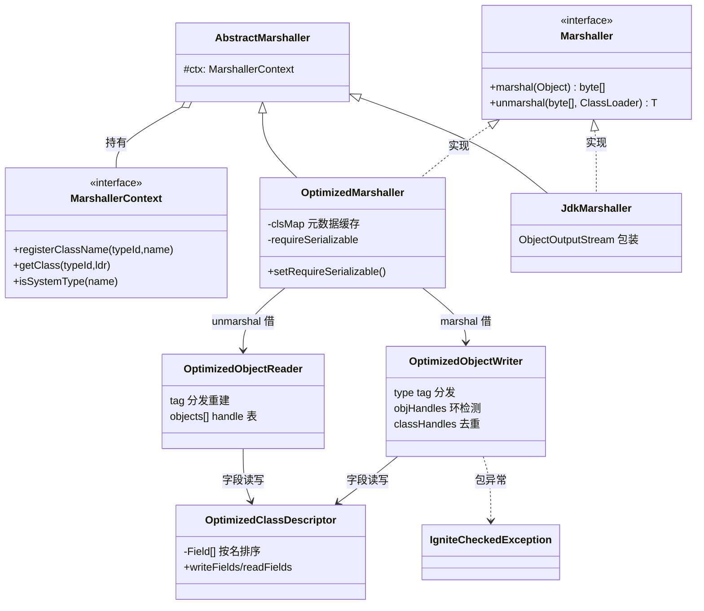
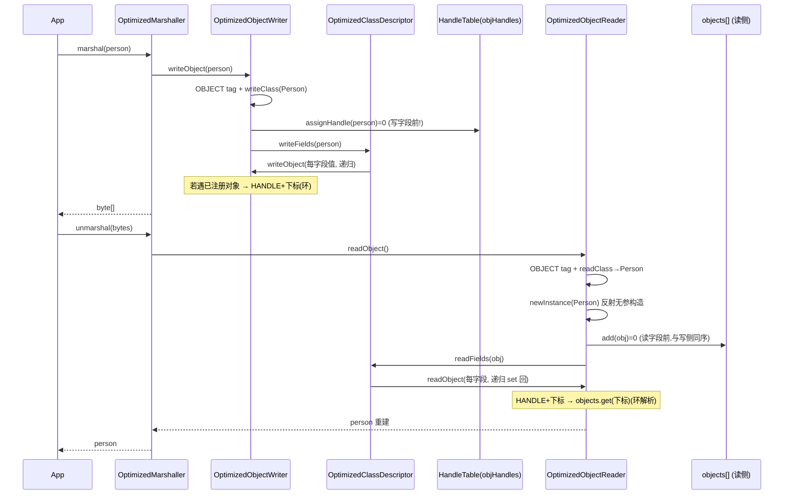

# S07 · 学习者讲义:Marshaller v2(Phase 2 收官)

> **教学法**(给人看)。**执行约束以 `specs/sessions/S07-marshaller.md`(执行规格)为准**。
> Phase 2 · Direct + Marshaller · v2。

## 教学目标
学完本 Session,你应当能够:
- 实现**可插拔 `Marshaller` SPI**:任意用户对象 ↔ `byte[]`,与 Direct 编解码**分工**(Direct=固定信封,Marshaller=任意载荷)
- 自建一个**比 JDK 序列化更小更快**的紧凑格式:type tag 分发 + `OptimizedClassDescriptor` 元数据缓存 + `HandleTable` 环检测
- 讲清**对象图环**怎么不栈溢出(handle 在写字段前先分配)、以及为什么学习版用**反射**而非 Ignite 的 `Unsafe`
- 把 Marshaller 载荷以 `byte[]` 搭进 S6 Direct 信封的 `writeByteArray` 字段,跑通**两层 seam**

## 核心概念与设计
### Marshaller vs Direct(分工)
- **Direct**(S6):固定协议消息(`Message` 接口,字段编译期已知)→ 自描述字段流,2 字节 type 注册表。
- **Marshaller**(S7):**任意**用户对象(运行期才知形状)→ 自定义紧凑格式,反射驱动。
- 二者以 `byte[]` seam 汇合:Marshaller 把对象编成 `byte[]`,塞进 Direct 信封的 `writeByteArray` 字段(P02 §3.3)。

### OptimizedMarshaller 的紧凑格式
每个值 = `[1 字节 type tag][载荷]`:
- `NULL` / `HANDLE`(环 back-ref)/ 8 个原语 tag / `STRING`(UTF-8)/ `UUID`(16B)/ `BYTE_ARRAY`(长度+字节)/ `ARRAY`(数组类+长度+元素)/ `OBJECT`(类描述+各字段)。
- boxed 原语(`Integer` 等)→ 直接写原语 tag(免 `OBJECT` 包裹,紧凑)。

### 三大机制
1. **`OptimizedClassDescriptor` 元数据缓存**:每个类**一次**反射收集非 static/transient 字段、**按名排序**,跨调用缓存(`clsMap`)。读写双方靠排序顺序对字段达成一致。Ignite 还缓存 Unsafe 偏移 + checksum,学习版裁剪。
2. **`HandleTable` 环检测**:每个可变图节点(对象/数组)**写字段前**分配 int handle(`IdentityHashMap`);再次遇到同一对象 → 写 `HANDLE`+下标。读侧用 `ArrayList` 按 DFS 前序填入,下标与写侧对齐 → 环/共享引用保持。
3. **类去重**:每流一个 class-handle 表(首类写全类名 + 注册到 context,之后写 handle)。

### 实例化(避 Unsafe)
`OptimizedMarshallerUtils.newInstance` 反射调用类的**无参构造器**(setAccessible)。Ignite 用 `sun.misc.Unsafe.allocateInstance` **绕过所有构造器**(能序列化无无参构造器的类);学习版避 Unsafe,故**要求类有无参构造器**(普通 POJO 都满足)。`requireSerializable` 默认 true(非 `Serializable` 抛)。

## 核心类设计与架构
> 图聚焦 S7 新增的 marshaller 包(放 `learning/internal/marshaller/`,镜像 SPI 契约 + 经典 Optimized 形态)。

| 类 | 职责 | 设计意图(为什么这么切) |
|---|---|---|
| `Marshaller` | 对象↔byte[] SPI(全抛 `IgniteCheckedException`) | 可插拔:下游(S16/S18/S30)只依赖接口 |
| `AbstractMarshaller` | 持 `MarshallerContext` | 共享 context 注入点 |
| `MarshallerContext`/`Impl` | typeId↔className↔Class 进程内注册表 | 镜像 Ignite 注册表(去 transport);独立可测 |
| `OptimizedClassDescriptor` | 每类字段元数据(反射 + 按名排序) | 跨调用缓存,免每流重算(Ignite 缓存 Unsafe 偏移) |
| `OptimizedObjectWriter`/`Reader` | type tag 分发 + handle 表 + 类去重 | 紧凑格式的读写引擎;per-stream 状态 |
| `OptimizedMarshaller` | 借 writer/reader + 持 clsMap + requireSerializable | marshaller 入口;clsMap 跨调用复用 |
| `JdkMarshaller` | `ObjectOutputStream` 一层包装 | 对照(体积基准)+ 兜底 |
| `IgniteCheckedException` | 统一 checked 异常 | 镜像 Ignite;SPI 全抛此异常 |

## 核心链路
> marshal→unmarshal 一来一回:对象经 writer(type tag + handle)→ bytes → reader 重建。含环引用的解析点。

## 关键原理(为什么)
- **为什么自定义格式比 JDK 序列化小**:JDK 序列化写流头(magic 4B + version 2B)+ 每类 `TC_CLASSDESC`(类名 + `serialVersionUID` 8B + flags + 字段数 + 每字段 name+类型签名)。学习版只写**类名一次 + 字段值**,免字段签名 → 对同一 POJO 小约 50B(见 `smallerThanJdkSerialization` 测试)。小演算:`Person{name,age,id,active,email,data[3]}`:JDK ≈ 流头6 + classdesc~60 + 值;Optimized ≈ 类名 + 值,省掉 classdesc 的字段签名部分。
- **为什么环不会栈溢出**:写 `a`(a.next=b, b.next=a)时,先给 `a` 分配 handle 0,**再**写字段;写到 `b.next=a` 发现 `a` 已在 handle 表 → 写 `HANDLE+0`(不递归)。读侧同理:读到 `a` 先建实例入 `objects[0]`,再读字段;`HANDLE+0` → `objects.get(0)` = 正在构建的 `a`。**关键:handle 在写字段前/读字段前分配**(DFS 前序,两侧同序)。
- **为什么用反射而非 Unsafe**:Ignite 用 `Unsafe.allocateInstance` 绕过构造器,能序列化"整条继承链都 Serializable 且无无参构造器"的类;但 Unsafe 危险(可绕过不变量、JDK 后续可能移除)。学习版用反射无参构造器 —— 覆盖普通 POJO(含 cache 值),无无参构造器的类抛清晰异常(诚实标注差距)。
- **为什么 `OptimizedClassDescriptor` 按字段名排序**:私有字段声明顺序在不同 JVM/编译器可能不同;按名排序让读写双方对"第 N 个字段是谁"达成一致(Ignite 同款)。学习版不缓存 Unsafe 偏移,但排序 + 缓存 `Field` 对象本身仍省反射查找。
- **为什么 `requireSerializable` 默认 true**:免构造器实例化非 Serializable 会跳过不变量初始化(footgun);Ignite 默认强制 Serializable,显式 `setRequireSerializable(false)` 才放行。学习版同款。

## 常见陷阱
- **环检测的 handle 必须在写字段前分配**:若先写字段再分配 handle,自引用 `a.next=a` 写时 `a` 还没入表 → 无限递归栈溢出。读侧同理(先建实例入表再读字段)。本实现 `writeOrdinary`/`readOrdinary` 严格遵守。
- **读写 handle 表必须 DFS 同序**:写侧 `assignObjHandle`、读侧 `objects.add` 必须在**完全相同**的遍历位置发生,否则下标错位、环解析到错对象。数组也参与(先 `assignObjHandle(arr)` 再写元素)。
- **要求无参构造器**:无无参构造器的类(Ignite 可用 Unsafe)→ 反射 `getDeclaredConstructor()` 抛 `NoSuchMethodException` → 包成 `IgniteCheckedException`。POJO 加个无参构造器即可。
- **`final` 字段**:学习版反射 `Field.set` 配 `setAccessible(true)` 能改 final 实例字段(非编译期常量);但测试夹具为清晰起见把 `name` 设为非 final。
- **类名上线而非 typeId-only**:学习版首类写全类名(robust,无需集群协商 typeId);Ignite 写 typeId(4B)+ 集群经 transport 协商映射。学习版的 `MarshallerContext.registerClassName(name.hashCode(), name)` 仍走 typeId 注册流,但线格式用名(防 typeId-only 反序列化依赖)。
- **`IdentityHashMap` 而非 `HashMap`**:handle 表用身份语义(同一对象实例),`HashMap` 用 equals 语义会把"值相等的不同对象"误判为同一 → 错误 back-ref。

## 自测题(你真的懂了吗)
1. 为什么 `writeOrdinary` 要**先** `assignObjHandle(o)` **再** `writeFields`?颠倒会怎样?
2. 一个 `a→b→a` 的环,序列化时 `b.next=a` 这一步写了几字节?(`HANDLE` 1B + int 4B = 5B,而非整个 a 子树)
3. `OptimizedObjectReader.objects` 和 `OptimizedObjectWriter.objHandles` 的下标为什么必然对齐?
4. 为什么用 `IdentityHashMap` 做 handle 表,而不是 `HashMap`?
5. `OptimizedMarshaller` 比 `JdkMarshaller` 序列化同一个 POJO 更小,主要省在哪?(提示:JDK 的 `TC_CLASSDESC` 写了什么)
6. 学习版为什么不能像 Ignite 那样序列化"没有无参构造器"的类?

## 与 Ignite 对照
**做了(对齐 Ignite 机制)**:
- 可插拔 `Marshaller` SPI(`marshal`/`unmarshal`,全抛 `IgniteCheckedException`)+ `AbstractMarshaller`;
- `OptimizedMarshaller` 自定义紧凑格式(type tag + 类去重 + `HandleTable` 环检测);
- `OptimizedClassDescriptor` 元数据缓存(反射字段 + 按名排序);
- 进程内 `MarshallerContext`(typeId↔className↔Class);
- `JdkMarshaller` 对照;`requireSerializable` 默认。

**不做/简化(详见 `specs/deferred.md` Phase 2)**:
- **BinaryObject 协议**(`BinaryObjectImpl`,2.18.0 现代默认 marshaller,另一套巨大子系统);
- **集群级 `MarshallerContextImpl`**:mapping transport(propose/accept)、文件存储(`MarshallerMappingFileStore`)、peer class loading;
- **`sun.misc.Unsafe`**:`allocateInstance` 绕构造器 + 字段偏移直访(学习版用反射);
- `Externalizable`、自定义 `writeObject`/`readObject`/`writeReplace`/`readResolve` 钩子;
- 特定集合特化(`ArrayList`/`HashMap` 专用分支);
- 流池(`OptimizedObjectStreamRegistry`)、`checksum`/`serialVersionUID` 校验;
- 安全过滤器(`IgniteObjectInputFilter`/`IgniteMarshallerClassFilter`,JEP 290);
- `ServiceLoader` 工厂装配、`.NET`/C++ 跨平台 interop(`DOTNET_ID`);
- typeId-only 线格式(学习版写全类名 + handle 去重,防单进程外的 typeId 解析依赖)。

> 现实校准:Ignite 2.18.0 已把 Marshaller 迁出 core 到 `modules/binary/{api,impl}`(经 ServiceLoader 装配)。学习版按 package-layout 放 `learning/internal/marshaller/{,optimized,jdk}`,镜像 **SPI 契约 + 经典 Optimized 形态**,不做 binary-module 拆分。
