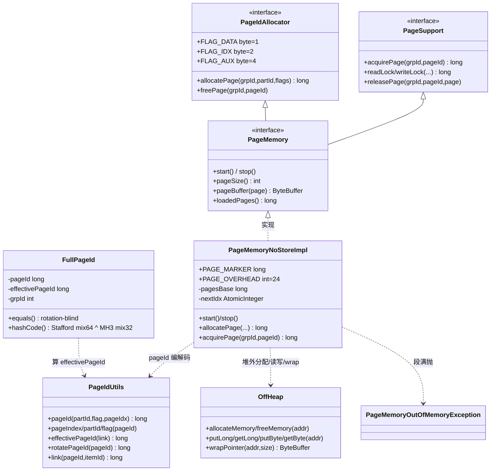
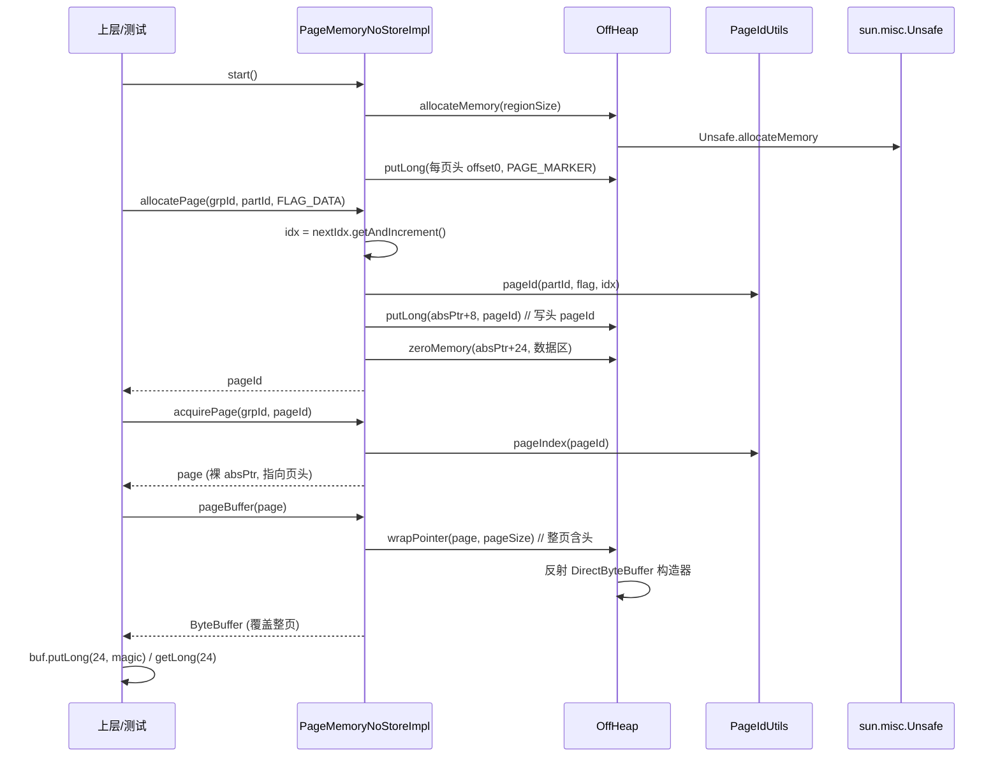

# S08 · 学习者讲义:PageMemory v1(页模型)

> **教学法**(给人看)。**执行约束以 `specs/sessions/S08-page-memory-v1.md`(执行规格)为准**。
> Phase 3 · 页内存 PageMemory · v1。

## 教学目标
学完本 Session,你应当能够:
- 把 `(partId, flag, pageIdx, rotation)` 用**纯位运算**压进一个 64-bit `long`,并解释 `effectivePageId` 为什么"rotation-blind"
- 讲清 Ignite 的页内存**不用 DirectByteBuffer、不做引用计数**,而是 **裸 `long` 指针 + `sun.misc.Unsafe`**——为什么这是性能心脏(零堆对象、页头就地嵌状态)
- 实现**页头 24B 布局**(`PAGE_MARKER` + `pageId` + `lock` 占位),用指针算术在一段堆外内存里切 N 页
- 把一个堆外裸地址**反射包成 `ByteBuffer`**(`wrapPointer`),并踩过 JDK 版本相关的构造器签名坑

## 核心概念与设计

### pageId 的 64-bit 布局(单一 `long` 一物多用)
```
 ┌──────────┬──────────┬───────────────┬──────────────────────────┐
 │ rotation │  flag    │    partId     │         pageIdx          │
 │  8 bit   │  8 bit   │    16 bit     │          32 bit          │
 │ bits63-56│ bits55-48│  bits47-32    │        bits31-0          │
 └──────────┴──────────┴───────────────┴──────────────────────────┘
  ROTATION_ID_OFFSET=56     EFFECTIVE_PAGE_ID_MASK = bits 0-47
```
- `pageIdx` 单 partition 内单调递增(32 bit → ~2³¹ 页/partition);`partId` 16 bit(上限 `MAX_PARTITION_ID=65500`);`flag` = DATA/IDX/AUX;顶 8 bit `rotation` 兼作回收代 / 页内 item 偏移。
- **`effectivePageId = link & ~(~0L<<48)`**:把 flag+rotation(bits 48-63)全抹掉,只留**身份**(pageIdx+partId)。`FullPageId.equals/hashCode` 只认它 + `grpId` → **rotation-blind + flag-blind**。

### 裸 `long` + Unsafe(而非 DirectByteBuffer / 引用计数)
roadmap 字面写"DirectByteBuffer(堆外)分配;页的 acquire/release 引用计数"。**真实 Ignite 两者都不是**(P03 §1 校准):
- 内存经 `sun.misc.Unsafe.allocateMemory` 按段拿(**不**走 `ByteBuffer.allocateDirect`);
- 页"句柄"是**裸 `long` 指针**,数据访问用 `getLong(addr)/putLong(addr,v)`;`pageBuffer(long)` 才按需把裸地址包成 `ByteBuffer` 给上层;
- `releasePage` **几乎是个 no-op**(**没有** per-page refcount / `Page` 对象 / pin 计数);"并发安全"靠 S9 的**页内 8 字节锁字**(`OffheapReadWriteLock`),不是数值引用计数。

**为什么裸指针**:页内存是热路径(每次缓存读写都触页),对象包装 / ByteBuffer 视图会引入分配与间接;裸指针让"锁字、free-list next、pageId"全部**就地嵌在页头字节里**,零堆对象、零间接。代价:需要 `Unsafe`(JDK 内部)。

### 页头 24B 布局(S8 与 Ignite 对齐)
```
 offset  0-7   PAGE_MARKER (8B,in-use 标记 / S9 free-list 的侵入式 next 槽)
 offset  8-15  pageId (PAGE_ID_OFFSET=8)
 offset 16-23  lock 占位 (LOCK_OFFSET=16;S9 才填 8B 锁字,LOCK_SIZE=8)
 PAGE_OVERHEAD = LOCK_OFFSET + LOCK_SIZE = 24
```

## 核心类设计与架构
> S8 落在 `learning/internal/pagemem/`(+`impl/`),镜像 `internal/pagemem/` 的页身份模型 + `PageMemoryNoStoreImpl` 的单段裁剪版。



| 类 | 职责 | 设计意图(为什么这么切) |
|---|---|---|
| `PageIdUtils` | 纯位运算静态工具(打包/拆解 pageId、effectivePageId、rotatePageId) | 纯函数、零依赖,可立即单测;镜像 Ignite 同名类 |
| `FullPageId` | 复合键 (grpId, pageId),rotation-blind equals/hashCode | 用作 cache 的页身份 map key;逻辑同一页即使回收复用(rotation 变)也稳定相等 |
| `PageIdAllocator` | 接口:flag 常量 + allocate/free 契约 | 立 S9 free-list 的接入面(S8 freePage 是 no-op) |
| `PageSupport` | 接口:acquire/release + 锁契约(**全裸 `long` 参**) | 立 S9 条带锁的接入面(锁失败返回 `0L`,S8 粗锁恒成功) |
| `PageMemory` | 顶层接口 `extends PageIdAllocator, PageSupport` + 生命周期/尺寸/pageBuffer | 下游(S9/S10/S12+)面向接口编程;**裁掉 Ignite `metrics()` 上漏** |
| `OffHeap` | `sun.misc.Unsafe` 薄包装 + wrapPointer 反射 | 把裸 Unsafe 收敛一处,后续可整体换 FFM(P03 §4.7 切换点) |
| `PageMemoryNoStoreImpl` | S8 纯内存实现:单段 bump + 24B 头 + 粗锁占位 | 镜像 Ignite `PageMemoryNoStoreImpl`(只取 start/acquire/release/pageBuffer/单段) |
| `PageMemoryOutOfMemoryException` | 段满异常 | 镜像 `IgniteOutOfMemoryException` 页内存场景 |

## 核心链路
> 分配一页并读写:上层经 `PageMemoryNoStoreImpl` → `PageIdUtils` 编码 → `OffHeap` 堆外分配/写入 → `wrapPointer` 包成 ByteBuffer 返回。



## 关键原理(为什么)

- **为什么 `effectivePageId` 是 flag-blind + rotation-blind**:`FullPageId` 要稳定充当 map key。逻辑同一页(partId+pageIdx+grpId)即使被回收复用(rotation 换了),map 查找也必须命中。`effectivePageId` 把 flag+rotation(bits 48-63)整体抹掉,只留身份。**回收代陈旧检测**由 S9 的 tag 锁(`readLock` 校验 `tag(pageId)==页头锁字 tag`,不符返回 `0L`)处理,与 `FullPageId` 相等性解耦。小演算:`pageId(part=5,DATA,100)` 与 `rotatePageId(它)`(rotation 0→1)的 effectivePageId **完全相同** → `equals` 为真。
- **为什么 `rotatePageId` 永不为 0**:rotation==0 是"新生成 / 未分配"的语义。回收复用要让 rotation 落在 1..254(`MAX_ITEMID_NUM=0xFE`),绕 `0xFE→1`,**永不回 0**。这样陈旧指针(指向已被复用成别页的内存)持有的 rotation 与当前页 rotation 不匹配,锁校验即可安全检出"use-after-free",不读到脏数据。
- **为什么 pageIdx 是 `int` 不是 `long`**:镜像 Ignite `pageId(int partId, byte flag, int pageIdx)`。32 bit → 单 partition ~2³¹ 页(21 亿),远超实际;`int` 让 pageId 打包算术更省。
- **为什么 `pageBuffer` wrap 整页(含 24B 头)而非仅数据区**:对齐 Ignite `pageBuffer(pageAddr)=wrapPointer(pageAddr, pageSize())`。返回的 ByteBuffer 覆盖 `[pageAddr, pageAddr+pageSize)`,调用方能读写头(`PAGE_MARKER`/`pageId`)和数据区(offset≥24),灵活度最高。
- **为什么 wrapPointer 要反射 DirectByteBuffer 构造器**:把 Unsafe 分配的裸地址给上层用 ByteBuffer API 读写,必须包成 `DirectByteBuffer`。JDK **没有公开 wrap 方法**,只能反射 `java.nio.DirectByteBuffer` 的包私有/private 构造器(Ignite 在 JDK 12+ 优先走 `SharedSecrets.getJavaNioAccess().newDirectByteBuffer`,构造器是 fallback;学习版只用构造器路径,简化)。

## 常见陷阱(本 session 真实踩到)

- **`DirectByteBuffer` 构造器签名随 JDK 版本变(最大坑)**:初版用 `Class.forName("java.nio.DirectByteBuffer").getDeclaredConstructor(long.class, int.class)`,在系统 JDK 21 跑出 `NoSuchMethodException`。实测 JDK 21 的 `DirectByteBuffer` **没有 `(long,int)` 2 参构造器**,只有 `private DirectByteBuffer(long addr, long cap)`(cap 是 `long`)。修正(镜像 Ignite `createAndTestNewDirectBufferCtor`):① 用 `ByteBuffer.allocateDirect(1).getClass()` 拿**运行时类**(而非 `Class.forName`);② 先 try `(long,int)`(JDK<21)失败再 try `(long,long)`(JDK≥21);③ 记下 cap 参数类型,**newInstance 时按类型传 `int` 或 `(long)size`**——反射**不自动 int→long 提升**,类型不匹配直接异常。Ignite 用 `IS_DIRECT_BUF_LONG_CAP = (majorJavaVersion >= 21)` 判定。
- **`--add-opens java.base/java.nio=ALL-UNNAMED`**:反射 package-private(JDK<21)/ private(JDK≥21)构造器,`setAccessible(true)` 在强模块化(JDK 16+)需此 opens,否则 `InaccessibleObjectException`。配在 surefire `<argLine>`。注意 **`sun.misc.Unsafe` 不需要**——它在 `jdk.unsupported` 模块,该模块设计上就 open 给 unnamed module。
- **`release=17` 但运行 JDK 21**:pom `maven.compiler.release=17`(字节码目标 17),但系统 JDK 21 编译+运行。反射拿到的是 **JDK 21 的 `DirectByteBuffer`** 类(`(long,long)` 构造器)。字节码兼容,无害,但要 aware(用 `buf.getClass()` 自动适配运行时类)。
- **`effectivePageId` 也抹 flag(不止 rotation)**:一度以为只抹 rotation。实际 `EFFECTIVE_PAGE_ID_MASK = ~(~0L<<48)` 抹 bits 48-63 = flag(48-55)+ rotation(56-63)。故 flag 不同(DATA vs IDX)但 partId+pageIdx 相同的两页,effectivePageId 相同 → `FullPageId.equals` 为真。这是 Ignite 真实行为(身份只认 partId+pageIdx),测试已覆盖。
- **`allocatePage` 段满回退 `nextIdx`**:`getAndIncrement()` 先占 idx 再检查越界;越界时 `decrementAndGet()` 回退,保证 `loadedPages()` 反映真实已分配数(满时 = `totalPages`,不虚增)。S8 单段无 free-list,段满即终态。

## 自测题(你真的懂了吗)
1. `effectivePageId` 抹掉了 pageId 的哪些 bits?为什么 `FullPageId.equals` 只看它 + `grpId`?
2. `rotatePageId` 为什么绕 `0xFE→1` 而非 `→0`?这和 use-after-free 安全有什么关系?
3. 一个 pageId 的 pageIdx 占多少 bit?单 partition 最多多少页?partId 呢?
4. JDK 21 的 `DirectByteBuffer` 2 参构造器签名是什么?为什么 `wrapPointer` 要记录 cap 参数类型、newInstance 时按类型传参?
5. 为什么 surefire 要 `--add-opens java.base/java.nio`,而 `sun.misc.Unsafe` 的反射获取不需要任何 opens?
6. S8 的 `releasePage` / `freePage` 为什么是 no-op?Ignite 的 `releasePage` 真做引用计数吗?(查源码:否,`trackAcquiredPages=true` 时只减测试计数器)
7. `pageBuffer(page)` 返回的 ByteBuffer 覆盖哪些字节?能从它读到 `PAGE_MARKER` 和 `pageId` 吗?(能,offset 0 / offset 8)

## 与 Ignite 对照
**做了(对齐 Ignite 机制)**:
- `PageIdUtils` 纯位运算(pageId 打包 + pageIndex/partId/flag/effectivePageId/rotatePageId/link/tag 拆解);
- `FullPageId` rotation-blind(且 flag-blind)equals/hashCode(Stafford mix64 + MH3 mix32);
- `PageIdAllocator` 接口(FLAG_DATA/IDX/AUX、MAX_PARTITION_ID、INDEX_PARTITION、META_PAGE_ID);
- `PageSupport` + `PageMemory` 接口(全裸 `long` 参,锁失败返回 `0L`);
- `OffHeap`(Unsafe 包装:allocate/free + 读写 + wrapPointer 反射构造器);
- `PageMemoryNoStoreImpl` 页头 24B 布局(PAGE_MARKER/PAGE_ID_OFFSET/LOCK_OFFSET/PAGE_OVERHEAD)+ 单段 bump + 段满 OOM。

**延后到 S9(roadmap 跟踪)**:
- 全局 **Treiber free-list**(页回收复用:侵入式 next + ABA 计数器);
- 多段惰性增长(SEG_CNT=16,`addSegment`);
- 条带 `OffheapReadWriteLock`(页内 8B 锁字 + tag 防陈旧 + upgrade);
- `DataRegion` 容器 + `DirectMemoryProvider` 抽象 + lifecycle 装配。

**不做/简化(详见 `specs/deferred.md` Phase 3)**:
- 页驱逐(`PageEvictionTracker`:NoOp/RANDOM_LRU/RANDOM_2_LRU)—— Ignite NoStoreImpl 本身零驱逐逻辑,驱逐是外挂协作者;
- `SharedSecrets`/JavaNioAccess wrapPointer 路径(JDK 12+ 优先)—— 学习版只用构造器反射一条路;
- FFM(`java.lang.foreign.MemorySegment`)材质 —— P03 §4.7 备选,Unsafe 保真优先(本类 `OffHeap` 是切换点);
- `metrics()` 上漏(`DataRegionMetricsImpl`)—— 学习版裁掉,S9 自定轻量 metrics;
- `trackAcquiredPages` 测试计数器 —— Ignite 测试专用,学习版 `releasePage` 干脆 no-op。
