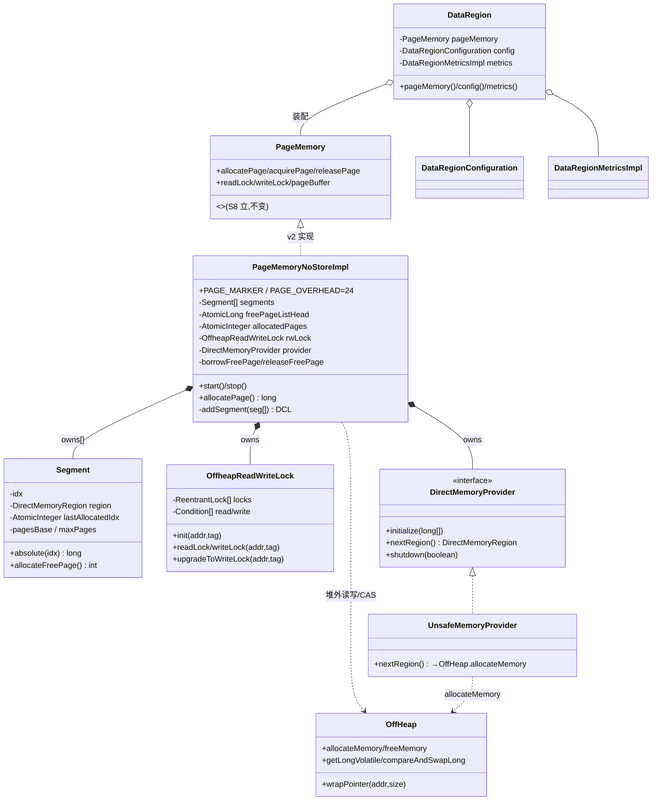

# S09 · 学习者讲义:PageMemory v2(DataRegion + free-list + 并发锁)

> **教学法**(给人看)。**执行约束以 `specs/sessions/S09-data-region-freelist.md`(执行规格)为准**。
> Phase 3 · 页内存 PageMemory · v2(Phase 3 收官)。

## 教学目标
学完本 Session,你应当能够:
- 用一个 `AtomicLong` + CAS 实现全局 **Treiber 无锁栈**做页回收复用,并解释**侵入式 next**(next 指针写在被释放页前 8 字节)与 **ABA 计数器**(head 高 8 位)为何需要
- 把锁状态直接存在**页内 8 字节锁字**里(而非外挂 map),并用 **tag** 检出 use-after-free(陈旧指针安全)
- 实现**条带 R/W 锁**:spin N 次再退化到 `ReentrantLock[]`+Condition park;读锁升级写锁(`upgrade`)
- 拆出 `DataRegion`(POJO 容器)+ `DirectMemoryProvider`(惰性 chunk),讲清"谁拥有谁"
- 把 S8 的单段实现**无缝升级**为多段 + free-list,**不改 PageMemory 对外契约**(下游透明)

## 核心概念与设计

### 1. 全局 Treiber free-list(页回收复用)
S8 分配的页**不回收**(bump 到底)。S9 让 `freePage` 的页入一个**全局无锁栈**,`allocatePage` 先 pop 复用。
- `freePageListHead: AtomicLong` = 低 56 位 relative pointer + 高 8 位 **ABA 计数器**。
- **侵入式 next**:被释放页的 **offset 0**(前 8 字节,复用 `PAGE_MARKER` 槽)就是 next 指针 → 零额外内存。
- **pop**(`borrowFreePage`):读 head → 读该页 offset 0 的 next → CAS(head → next | 计数器+1)。
- **push**(`releaseFreePage`):写旧 head 到本页 offset 0(= next)→ CAS(head → 本页 relPtr)。

### 2. 页内 8B 锁字 + tag 防陈旧
锁**状态存在页本身**(`pagePtr + LOCK_OFFSET`),不是外挂 map。8 字节布局:
```
 | WRITE_WAIT_CNT(16) | READ_WAIT_CNT(16) | TAG(16) | LOCK_CNT(16) |
 LOCK_CNT: 0=自由; -1=写锁(独占); >0=N 个读者(signed short)
 TAG: 回收代。锁时校验 tag(pageId) == 锁字 TAG;不符 → 页已被复用 → 返回 0L(use-after-free 安全)
```
- `readLock/writeLock` = volatile 读锁字 → checkTag → CAS 推进 LOCK_CNT。
- spin `SPIN_CNT=32` 次抢不到 → 退化条带 `ReentrantLock[idx]`+Condition park(await/signal)。

### 3. 多段惰性增长
S8 单段一次性分配。S9:`Segment[]`,首段 `initialSize`,末段满 `addSegment`(synchronized+DCL)拉下一段(`DirectMemoryProvider.nextRegion()`)。
- pageIdx 高 `SEG_BITS=4` 位编码段号(`segmentIndex = pageIdx >> 28`)→ free-list relPtr **跨段**(释放的页可落任意段)。

## 核心类设计与架构
> S9 落在 `learning/internal/pagemem/`(+`impl/`)+ `learning/internal/util/`+ `learning/internal/mem/`,镜像 `internal/pagemem/impl/` + `internal/util/` + `internal/mem/`。



| 类 | 职责 | 设计意图 |
|---|---|---|
| `PageMemoryNoStoreImpl` v2 | 多段 + free-list + 锁的完整实现 | **不改 S8 接口**,只升级实现(下游透明) |
| `Segment` | 一段堆外内存按页切;`AtomicInteger` bump | 段内无锁分配(CAS);高 4 位 pageIdx 编码段号 |
| `OffheapReadWriteLock` | 页内 8B 锁字 R/W 锁 + tag | 锁状态就地存页头(热路径零间接);tag 防 use-after-free |
| `DirectMemoryProvider`/`UnsafeMemoryProvider` | 惰性产出堆外 chunk | 解耦分配材质(后续可换 FFM);支持 lazyMemoryAllocation |
| `DataRegion` | POJO 容器(PageMemory+config+metrics) | 存储组入口;自身无 lifecycle(外部驱动) |
| `OffHeap`(S9 扩展) | 补 `getLongVolatile`/`compareAndSwapLong` | 锁字 CAS + free-list head CAS 需要 |

## 核心链路
> `allocatePage` 一次分配:先 pop free-list(回收复用)→ 未命中走末段 bump → 满则 addSegment;写头 + init 锁字。

```mermaid
sequenceDiagram
    participant T as 上层
    participant PM as PageMemoryNoStoreImpl
    participant FL as freePageListHead(AtomicLong)
    participant S as Segment(末段)
    participant L as OffheapReadWriteLock
    participant OH as OffHeap
    T->>PM: allocatePage(grpId,partId,flags)
    PM->>FL: borrowFreePage — CAS pop
    alt free-list 命中(有回收页)
        FL-->>PM: relPtr
        PM->>OH: 读页 offset0 next / 标 PAGE_MARKER
        PM->>PM: absPtr = segment(relPtr).absolute(relPtr)
    else free-list 空
        PM->>S: allocateFreePage() — CAS bump lastAllocatedIdx
        alt 末段有空间
            S-->>PM: pageIdx
        else 末段满
            PM->>PM: addSegment(segs) — synchronized+DCL
            PM->>S: 新末段 allocateFreePage
        end
    end
    PM->>OH: putLong(absPtr, PAGE_MARKER) ; putLong(absPtr+8, pageId)
    PM->>L: init(absPtr+16, tag(pageId)) — LOCK_CNT=0, TAG=tag
    PM->>OH: zeroMemory(absPtr+24, 数据区)
    PM-->>T: pageId
    Note over T,FL: freePage(pageId) 时:写旧 head 到页 offset0 → CAS(head→relPtr) 入栈,下次 allocatePage 复用
```

## 关键原理(为什么)

- **为什么侵入式 next(写在页 offset 0)**:页内存零堆对象是核心目标。把链表 next 指针**就地写在被释放页的前 8 字节**(与 in-use 时该位置放 `PAGE_MARKER` 复用同一槽),省掉 per-node 的 `Node` 对象分配。代价:页头 8 字节被复用(需 PAGE_MARKER/in-use 标记区分)。
- **为什么需要 ABA 计数器**:无锁栈经典 ABA——T1 读 head=A 准备 pop,被抢;T2 pop A、pop B、push A(head 又=A 但 B 已没了);T1 恢复 CAS(A→B)成功 → 栈损坏。head 高 8 位计数器每次 pop +1,即使 relPtr 回到 A,计数器不同 → T1 的 CAS 失败。**注**:push 时计数器随 relPtr 高位清 0(Ignite 同款),故"单调"体现在**连续 pop**(见 `FreeListTest#abaCounterMonotonic`)。
- **为什么 tag 防陈旧是精髓**:堆外内存无 GC,页被回收复用后,旧指针仍指向那块内存(已属别页)。锁时校验 `tag(pageId)==锁字 TAG`,tag 随 rotatePageId 换页而变 → 陈旧指针锁返回 `0L`,**读不到脏数据**。这是"无 GC 堆外内存"做安全并发的关键不变量(`PageLockTest#tagStaleDetection`)。
- **为什么锁状态存页内 8B 锁字而非外挂 map**:热路径(每次触页都锁),外挂 `ConcurrentHashMap<pageId,Lock>` 有 hash + 对象分配开销;锁字就地存页头,CAS 推进零间接。条带 `ReentrantLock[]` 只用于争用时的 park/wake(不参与锁状态)。
- **为什么 Segment 用 AtomicInteger 而非 Ignite 的堆外 lastAllocatedIdxPtr**:Ignite 把 bump 指针放堆外(段内 CAS 无 Java 锁)。学习版用 `AtomicInteger`(Java CAS)简化——功能等价,且**不占堆外 8 字节**(否则 maxPages 会少 1,破坏 S8 测试边界)。讲义诚实标注此差距。
- **为什么 S8→S9 契约不变**:S8 立的 `PageMemory`/`PageIdUtils`/`FullPageId` 是下游(S13/S16/S15)的契约面。S9 只升级 `PageMemoryNoStoreImpl` 内部(加 free-list/多段/锁)+ 新暴露 `DataRegion`。下游面向接口编程,S8 单段测试在 v2 上**原样跑过**(回归保护)。

## 常见陷阱(本 session 真实踩到)

- **`freePage` 返回类型跨 session 不可改**:初版照 Ignite 写 `boolean freePage`,但 S8 的 `PageIdAllocator.freePage` 契约是 `void`(S9 §2 契约稳定性)。编译报"返回类型不兼容"。改回 `void`。**教训**:对外契约一旦立,后续 session 只能升级实现,不能改签名(否则回填所有下游)。
- **`AtomicLong.increment()` 不存在**:metrics 初用 `AtomicLong`,调 `.increment()` —— 那是 `LongAdder` 的方法。改 `DataRegionMetricsImpl.totalPages()` 返回 `LongAdder`(高并发友好,Ignite 的 PageMetrics 同款)。
- **`writeUnlock` 的 `updated` 变量作用域**:在 `while(true)` 内声明 `long updated`,break 后读 `updated` → 编译错"找不到符号"。提到循环外声明(`long updated = 0;`)。
- **PAGE_MARKER 写在 offset 0(不能漏)**:简化 `Segment.allocateFreePage` 时去掉了 `putLong(absPtr, PAGE_MARKER)`,结果 S8 继承测试 `pageHeaderLayout` 读 offset 0 得 0。修复:在 `allocatePage` 公共部分(两条路径汇合后)统一写 `putLong(absPtr, PAGE_MARKER)`——borrowFreePage 也靠它标 in-use(覆盖 free-list 写的 next)。
- **ABA 计数器 push 时清 0**:连续 pop 才单调(push 后 head 高位=0)。测 `abaCounterMonotonic` 必须先连续 push 入栈、再连续 pop 观察,而非 pop-push 交替。
- **`pageSize()` 语义**:Ignite 是 `sysPageSize - PAGE_OVERHEAD`(数据区);学习版 S8/S9 统一用整页(`pageSize==systemPageSize`),讲义标注差距——S8 测试的 offset 24 写读仍 work。

## 自测题(你真的懂了吗)
1. free-list 的 next 指针存在哪?为什么不需要额外分配 `Node` 对象?
2. ABA 计数器在 head 的哪些 bit?为什么 push 后会"重置"(relPtr 高位=0),它到底防什么?
3. 一个被 `freePage` 回收的页,再次 `allocatePage` 时,offset 0 经历了什么(next → PAGE_MARKER)?
4. tag 防陈旧:持有旧 pageId 的线程调 `readLock`,为什么返回 `0L` 而非读到脏数据?锁字里的 TAG 是什么时候、由谁写的?
5. 为什么 Segment 用 `AtomicInteger` bump 而非 Ignite 的堆外 `lastAllocatedIdxPtr`?这个简化对 S8 测试为什么是必要的?
6. `addSegment` 为什么是 `synchronized`+DCL?如果去掉 DCL 只留 synchronized,会怎样?
7. S8 的 `PageMemoryNoStoreImplTest`(单段)在 S9 的 v2 实现上为什么能原样跑过?这验证了什么契约性质?

## 与 Ignite 对照
**做了(对齐 Ignite 机制)**:
- 全局 Treiber free-list(侵入式 next + ABA 计数器 + CAS pop/push);
- 多段惰性增长 + `addSegment`(synchronized+DCL)+ pageIdx 高位编码段号;
- 条带 `OffheapReadWriteLock`(8B 锁字 `LOCK_CNT/TAG/READ_WAIT/WRITE_WAIT` + tag 防陈旧 + spin→条带 park + upgrade);
- `DirectMemoryProvider`/`UnsafeMemoryProvider` 抽象 + `DirectMemoryRegion`;
- `DataRegion` POJO 容器(去掉 `PageEvictionTracker`)+ `DataRegionConfiguration` + `DataRegionMetricsImpl`;
- `OffHeap` 补 volatile/CAS(`getLongVolatile`/`compareAndSwapLong`,null-as-Object 技巧)。

**延后/简化(详见 `specs/deferred.md` Phase 3)**:
- **页驱逐**(`PageEvictionTracker`):NoOp/RANDOM_LRU/RANDOM_2_LRU(S8 已列 deferred);
- **锁公平调度**:write-waiter 优先抢占读 + 随机唤醒策略(`IGNITE_OFFHEAP_RANDOM_RW_POLICY`)+ 完整 `signalNextWaiter` 公平链 —— 学习版 unlock 后简单 signalAll(写优先);
- **SEG_CNT=16 完整分段**:学习版 chunks 仅两段(initialSize + 余量);
- **堆外 `lastAllocatedIdxPtr` CAS bump**:学习版用 `AtomicInteger`(段内 Java CAS,不占堆外);
- **`SharedSecrets`/JavaNioAccess wrapPointer 路径**(S8 已列);**FFM 材质**(S8 已列);
- **`trackAcquiredPages` 测试计数器**:学习版 `releasePage` no-op。

> **Phase 3 收官**:S8(页模型 v1)+ S9(free-list + 多段 + 锁 v2)= 完整 `PageMemoryNoStoreImpl`。"可管理、并发安全的堆外页内存"就位,下游 WAL(Phase 4)/ PageStore+B+树+Checkpoint(Phase 5→M1)建其上。`PageMemory` 接口契约自 S8 起稳定,后续透明升级。
