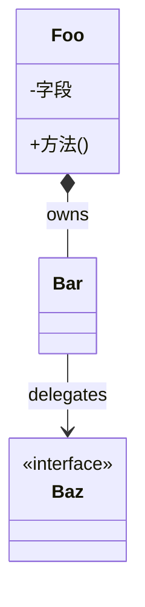

# [SNN-短名] · 学习者讲义(handout)

> **教学法**(给人看)。**执行约束以执行规格 `specs/sessions/SNN-短名.md` 为准**;本讲义不影响 AI 执行。
> **必写**(每个有执行规格的 session 都要有讲义);写完跑 `scripts/check-handouts.sh`。

**Session**:SNN · <标题>  **Phase**:Phase N · <子系统>

---

## 教学目标
学完本 Session,你应当能够:
- 理解 ……
- 解释 为什么……
- 动手实现 ……

## 核心概念与设计
> 带 ASCII / Mermaid 图(机制 / 流程)。
- ……

## 核心类设计与架构
> **图(mermaid `classDiagram`)管"类怎么组合"**:containment(`*--`)/ 继承(`<|--`)/ 关联(`-->`)/ 依赖(`..>`)。
> **表管"为什么这么切"**(设计意图)。图嵌 ` ```mermaid ` 源码(GitHub / VS Code 渲染,可 git diff)。



| 类 | 职责 | 设计意图(为什么单独成类) |
|---|---|---|
| `Foo` | …… | …… |

## 关键原理("为什么")
> 算法/机制 + 一个小演算(手算例子)。
- ……

## 常见陷阱
> 本子系统特有的坑。
- ……

## 自测题(你真的懂了吗)
1. ……

## 与 Ignite 对照
> 做到/超过里程碑时填。
- ……
