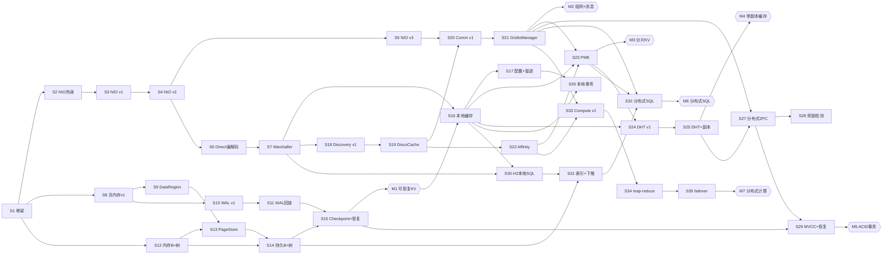

# 从零手搓 Apache Ignite · 完整学习路线(Roadmap)

> 驱动提示词:`docs-prompt/ignite-roadmap-prompt.md`(经 `/grill-me` 三轮验证定稿)
> 参考实现:`vendors/ignite`(tag **2.18.0**),所有"镜像源码"路径均经核实真实存在。
> 目标读者:**CS 在校生**(Java 与分布式系统都需铺垫)。

---

## 0. 概述(TL;DR)

这是一条**存储优先、Session 化增量**的学习路线:从"一个能 echo 的 NIO 服务器"起步,每一步都**可运行、有单测**,沿着真实依赖边把 Apache Ignite 的 core 一层一层重建出来,走完全程你将得到一个架构 ≈ Ignite 的迷你实现。

- **不是**按源码目录顺序读代码;**是**按"一个实现者真正能顺着依赖把系统重建出来"的顺序造轮子。
- 每个子系统走 **v1(最小可运行)→ v2(功能完整)→ v3(忠实)** 保真阶梯。
- 每个 **Session** 站在上一 Session 的代码上往下做;到达**里程碑 M1~M7** 时补端到端测试 + demo + 与 Ignite 的性能/正确性基准对比。

## 1. 如何使用本文档

1. **严格顺序**:Session 全局编号(S1, S2, …),后置 Session 的"前置"只引用更早的 Session。不要跳。
2. **每个 Session 必须做到三件事再进下一个**:① 代码可运行(`mvn test`/demo 绿);② 有匹配单元测试;③ 能口头讲清"这步在镜像 Ignite 的哪个机制"。
3. **对照源码**:每个 Session 给出 `vendors/ignite` 路径,先读对应 Ignite 代码理解"目标形态",再自己复现(不是抄)。
4. **里程碑(M1~M7)**:到这里停下来,补 e2e 测试 + demo + 与 Ignite 基准对比,再继续。

## 2. 设计决策(节选,详见提示词文件)

| 维度 | 决策 |
|---|---|
| 保真规则 | Ignite 自写层纯 JDK 手写;Ignite 用第三方库处我们同用(如 SQL→H2) |
| 主线 | 存储优先:PageMemory→WAL→B+树→本地KV→集群→PME→DHT→事务→SQL→计算 |
| 纳入 | NIO+Marshaller / Discovery / Communication / Kernal / PageMemory / WAL+PageStore+B+树+Checkpoint / 本地缓存 / Affinity / PME / DHT+副本 / 完整事务 / SQL(H2) / 完整Compute |
| 后置扩展 | Service Grid / Continuous Query / Data Streamer / 数据结构 / Thin client / ODBC / JDBC |
| 排除 | 平台(.NET/C++) / 安全·认证·加密 / ML / 集成 / benchmark |
| 代码组织 | 每个 Session 一个**独立的多模块 Maven 工程**,放 `ignite-gogogo/sNN-短名/`;新 Session 以上一 Session 工程为起点复制再扩展(增量落在独立工程上) |

### 依赖锚点(已核实结构事实,排序以此为准)
- **Discovery ⊥ Communication**:Discovery 用裸 `ServerSocket`,不依赖 `GridNioServer`/`GridIoManager`;仅 `GridIoManager` 单向读 Discovery 拓扑寻址。⇒ 二者可并列开发,但 Communication 的路由依赖 Discovery。
- **持久化层完全隔离**:PageMemory+WAL+B+树只用文件 IO,**无需集群即可最先独立构建并单测**。这是为什么本路线把存储排在集群之前。
- **Affinity 是纯拓扑数学**:只读 Discovery 视图,排在 Discovery 之后、PME 之前。

### 依赖 DAG(全局视图)

> 横向≈时间。**同一阶段可并行的支路**:基础就绪后,**存储支(S8~S15)** 与 **网络/序列化支(S3~S7)** 可并行推进。**关键路径**(最长依赖链)经 `M1 → S23 → S25 → S27 → S29 → M5`——**事务(M5)是全路线的"长杆"与难度峰**,排期/精力分配以此为准。

---

## 3. 文档与资产体系

本路线不只有这一份 roadmap。文档按**用途/生命周期**分三类(避免把 roadmap 撑成不可扫读的大文档):

| 类别 | 位置 | 职责 | 何时建 |
|---|---|---|---|
| **路线图** | `specs/ignite-complete-learning-roadmap.md`(本文) | 序列 + 规格 + 依赖 DAG;terse、可扫读 | 已建 |
| **全局参考资产** | `specs/assets/*.md` | 跨 Session 复用的稳定参考 | 按需,先于用到它的 Session |
| **每 Session 教学文档** | `specs/sessions/SNN-短名.md` | 一节课的内容(目标/概念/原理/源码导读/陷阱/思考题)+ 执行前分析(本 Session 代码落点与设计) | just-in-time,做到该 Session 时再写 |

**全局参考资产(待建立,路径已定):**
- `specs/assets/glossary.md` — **术语表**:PME / DHT / near·dht·colocated / PageMemory / WAL / DiscoCache… → 通俗解释 + 源码位置。
- `specs/assets/reading-ignite-source.md` — **源码导读 primer**:如何读 Ignite 源码 + `IgniteKernal.start()` 启动主线(`GridIoManager`@~1004、`GridDiscoveryManager`@~1016…)。
- `specs/assets/package-layout.md` — **包结构总览**:学习者实现的目标包树(对齐 Ignite 的 `internal/util/nio`、`internal/pagemem`、`processors/cache`…),即全局代码骨架。
- (可选)`specs/assets/testing-distributed.md` — 分布式/并发系统的测试策略。

**关于"学习者代码骨架"**:分两层——① 全局总览在 `assets/package-layout.md`;② 每个 Session"本 Session 代码往哪写、新增哪些类"放在该 Session 教学文档的「执行前分析」章节。**不单独建第三类文档**,避免碎片化。

**每 Session 教学文档约定:**
- 路径:`specs/sessions/SNN-短名.md`(如 `S12-btree.md`、`S03-nio-engine.md`)。
- 模板:见 `specs/sessions/_TEMPLATE.md`。
- 建立时,在本文对应 Session 块末尾追加:`**教学文档**:[SNN-短名](sessions/SNN-短名.md)`。
- **just-in-time**:不要预先批量写;做到某 Session 时再写——避免重蹈"先完全掌握"的幻觉(见提示词防幻觉条款)。

---

# Part Ⅰ — 基础与存储(到 M1:单节点可恢复持久化 KV)

## Phase 0 · 前置基础

### Session 1(S1)— 项目骨架与测试基础设施
- **Phase / 子系统**:Phase 0 / 工程基础
- **目标 / 学到**:建立可长期成长的多模块 Maven 工程;固定"每段代码都有测试"的工作流。
- **镜像源码**:`vendors/ignite/pom.xml`、`vendors/ignite/parent/`、`vendors/ignite/modules/core/pom.xml`(看模块划分思路,不照抄)。
- **前置**:无。
- **实现要点**:
  - v1:Maven 多模块工程骨架(本 Session 独立工程 `ignite-gogogo/s01-skeleton/`:父 pom + `core` 子模块,Java 包根 `org.apache.ignite.learning`),`mvn -q compile` 通过。
  - v1:接入 JUnit 5 + AssertJ;写一个 `HelloTest` 跑绿。
  - v1:约定目录:`internal/` 放实现、`spi/`/`cache/` 放契约(对齐 Ignite 习惯)。
- **验收**:demo = `mvn test` 全绿;单测覆盖 `HelloTest`。
- **难度 / 工时**:⭐ / 0.5 天。
- **产出物**:可编译可测试的多模块骨架。

### Session 2(S2)— Java 并发与 NIO 热身
- **Phase / 子系统**:Phase 0 / 语言基础
- **目标 / 学到**:补齐 CS 学生最缺的两块——NIO(Selector/Channel/ByteBuffer)与并发(线程池/Future/锁),为 S3 的 NIO 引擎铺路。
- **镜像源码**:`vendors/ignite/.../internal/util/nio/`(只读,看目标形态)、`.../internal/util/`(`GridConcurrent*`、striped lock 等并发原语,只读)。
- **前置**:S1。
- **实现要点**:
  - v1:手写一个**单线程 Selector echo server** + 客户端,用长度前缀帧消息(非 Ignite 复刻,纯热身)。
  - v1:复习 `ThreadPoolExecutor`、`CompletableFuture`、`ReentrantLock`/`StampedLock`;写 1~2 个并发小练习。
- **验收**:demo = echo server 两端跑通;单测覆盖帧编解码与线程池行为。
- **难度 / 工时**:⭐⭐ / 2~3 天。
- **产出物**:echo server 原型 + 并发笔记。

---

## Phase 1 · 异步 NIO 引擎(镜像 `GridNioServer`)

> Ignite 的网络底座是一个**自研的异步 NIO 框架**(selector workers + filter chain),后续 Discovery、Communication 都要复用它(注:Discovery 实际走自己的裸 socket,见依赖锚点——但 NIO 引擎是 Communication/客户端的根,先造)。

### Session 3(S3)— NIO 引擎 v1:会话 + 消息帧
- **镜像源码**:`.../internal/util/nio/GridNioServer.java`、`GridNioSession.java`、`GridNioFilterChain.java`。
- **前置**:S2。
- **实现要点**:
  - v1:`NioServer` 单 selector + `NioSession`(读/写缓冲区);长度前缀帧编解码;`send()`/接收回调。
  - v1:一个最简 filter 链接口(`NioFilter`,protocol → 等价 GridNioFilterChain 的雏形)。
- **验收**:demo = 两个 JVM 用 NioServer 互发结构化消息;单测覆盖帧的粘包/半包。
- **难度 / 工时**:⭐⭐⭐ / 3~5 天。
- **产出物**:`NioServer` v1。
- **教学文档**:[S03-nio-engine](sessions/S03-nio-engine.md)

### Session 4(S4)— NIO 引擎 v2:多 worker + 过滤链
- **镜像源码**:`.../internal/util/nio/GridNioWorker.java`、`GridNioFilterChain.java`、`GridSelectorNioSessionImpl.java`。
- **前置**:S3。
- **实现要点**:
  - v2:多 worker(每个 worker 一个 selector,按连接哈希分配)——理解 Ignite 的"读 worker / 写 worker"模型。
  - v2:完整过滤链(codec/log/ssl 占位过滤器),消息在链中流转。
- **验收**:demo = 多连接并发压测不串号;单测覆盖多 worker 下的消息顺序与背压写缓冲。
- **难度 / 工时**:⭐⭐⭐⭐ / 5~7 天。
- **产出物**:`NioServer` v2(后续 Communication 的传输根)。

### Session 5(S5)— NIO 引擎 v3:恢复 + 背压
- **镜像源码**:`.../internal/util/nio/`(recovery descriptor、SSL filter 相关类)。
- **前置**:S4。
- **实现要点**:
  - v3:连接恢复(recovery descriptor:重连 + 消息去重/序号);写缓冲背压(超限阻塞或丢弃策略)。
  - v3:SSL filter 留接口、可跳过实现(标记为 TODO)。
- **验收**:单测覆盖断线重连后消息不丢不重;demo = kill -9 一个 worker 后恢复。
- **难度 / 工时**:⭐⭐⭐⭐ / 4~6 天。
- **产出物**:生产级可用的 NIO 引擎。

---

## Phase 2 · Marshaller + Direct 消息编解码

### Session 6(S6)— Direct 消息编解码 v1
- **镜像源码**:`.../internal/direct/`(`DirectMessageReader`/`DirectMessageWriter`)、`.../internal/marshaller/`。
- **前置**:S4(消息帧已就绪)。
- **实现要点**:
  - v1:消息类型注册表(类型 ID ↔ 工厂);`DirectMessage` 基类 + reader/writer 按字段顺序读写(紧凑二进制,而非 Java 序列化)。
  - v1:跑通"NioServer 收发一条自定义 `PingMessage`"。
- **验收**:demo = 经 NioServer 发送/接收结构化消息;单测覆盖多种字段类型的往返一致性。
- **难度 / 工时**:⭐⭐⭐ / 3~4 天。
- **产出物**:`DirectMessage` 编解码 + 类型注册表。

### Session 7(S7)— Marshaller v2
- **镜像源码**:`.../internal/marshaller/`(optimized marshaller、`Marshaller` SPI 接口)。
- **前置**:S6。
- **实现要点**:
  - v2:可插拔 `Marshaller` 接口;实现一个"优化 marshaller"(对象↔字节,处理基本类型/数组/嵌套),供后续对象值序列化。
  - v2:与 Direct 编解码分工:Direct 用于固定协议消息,Marshaller 用于任意用户对象。
- **验收**:单测覆盖对象往返 + 体积对比 Java 序列化。
- **难度 / 工时**:⭐⭐⭐ / 3~5 天。
- **产出物**:可插拔 Marshaller。

---

## Phase 3 · 页内存 PageMemory(镜像 `internal/pagemem/`)

> 这是 Ignite 性能的心脏:把数据放在**堆外按"页"管理**的内存里,后续 WAL/B+树/Checkpoint 都建在"页"之上。**完全隔离,不需要集群。**

### Session 8(S8)— PageMemory v1:页模型
- **镜像源码**:`.../internal/pagemem/PageMemory.java`、`PageIdAllocator.java`、`PageIdUtils.java`、`PageMemoryNoStoreImpl.java`、`FullPageId.java`。
- **前置**:S1(并发原语)。
- **实现要点**:
  - v1:页模型——固定大小页(如 4KB),用 `DirectByteBuffer`(堆外)分配;`PageId`/`FullPageId` 编码(cacheId+pageIdx);页的 acquire/release 引用计数。
  - v1:`PageMemory` 接口 + 一个纯内存实现(分配 N 页、按 id 读写页字节)。
- **验收**:单测覆盖分配/释放/读写页字节、页 id 编解码往返。
- **难度 / 工时**:⭐⭐⭐ / 3~5 天。
- **产出物**:`PageMemory` 纯内存实现。

### Session 9(S9)— PageMemory v2:DataRegion + free list
- **镜像源码**:`.../internal/pagemem/`(DataRegion、`PageMemoryNoStoreImpl` 的分配/free list 部分)。
- **前置**:S8。
- **实现要点**:
  - v2:`DataRegion`(一段连续堆外内存 + 可配初始/最大值);页分配器 + **free list**(释放的页可复用)。
  - v2:并发安全的分配/释放(striped lock 或 CAS)。
- **验收**:demo = 分配大量页后释放,再分配复用(观测物理内存不无限增长);单测覆盖 free list 正确性与并发。
- **难度 / 工时**:⭐⭐⭐⭐ / 4~6 天。
- **产出物**:可管理的 DataRegion + free list。

---

## Phase 4 · WAL(镜像 `persistence/wal/`)

### Session 10(S10)— WAL v1:记录 + 追加写
- **镜像源码**:`.../internal/pagemem/wal/`(`IgniteWriteAheadLogManager` 接口、record 类型)、`.../internal/processors/cache/persistence/wal/FileWriteAheadLogManager.java`。
- **前置**:S8(页模型)。
- **实现要点**:
  - v1:WAL 记录模型(如 `PutRecord`/`PageSnapshot` 等价的几种 record);`FileWriteAheadLogManager` 等价——追加写文件 + fsync 策略(每次/周期)。
  - v1:为页的每次修改产生一条 WAL 记录(先写日志,再改页)。
- **验收**:单测覆盖 record 序列化往返、追加写顺序完整。
- **难度 / 工时**:⭐⭐⭐ / 3~5 天。
- **产出物**:可追加写的 WAL。

### Session 11(S11)— WAL v2:回放 + 截断
- **镜像源码**:`.../internal/processors/cache/persistence/wal/FileWriteAheadLogManager.java`(replay、segment 轮转、checkpoint 截断相关)。
- **前置**:S10。
- **实现要点**:
  - v2:WAL **回放**(读日志重放到页);日志段(segment)轮转;在 checkpoint 后截断旧日志(与 S15 的 checkpoint 联动)。
  - v2:启动时"重放未 checkpoint 的日志"恢复内存状态(单节点恢复的雏形)。
- **验收**:demo = 写若干页 → 模拟崩溃 → 重启回放后状态一致;单测覆盖回放幂等与截断边界。
- **难度 / 工时**:⭐⭐⭐⭐ / 4~6 天。
- **产出物**:可恢复的 WAL。

---

## Phase 5 · PageStore + B+树 + Checkpoint → **里程碑 M1**

### Session 12(S12)— B+树 v1:纯内存 B+树
- **镜像源码**:`.../internal/processors/cache/persistence/tree/`(B+tree 实现,如 `BPlusTree`)。
- **前置**:S1。
- **实现要点**:
  - v1:纯内存 B+树(可配阶数)的 insert / search / delete + 叶链;理解"为什么 Ignite 用 B+树组织索引页"。
  - v1:与 S8 的"页"暂时解耦,先吃透 B+树算法本身。
- **验收**:单测覆盖大量随机插入/删除后的结构正确性 + 范围扫描。
- **难度 / 工时**:⭐⭐⭐⭐ / 5~7 天。
- **产出物**:内存 B+树。

### Session 13(S13)— PageStore v2:页落盘
- **镜像源码**:`.../internal/pagemem/store/`(`IgnitePageStoreManager`、`PageStore`)、`.../internal/processors/cache/persistence/`(page store file IO)。
- **前置**:S9(PageMemory), S12。
- **实现要点**:
  - v2:`PageStore`——每个 cache/partition 一个文件,按 pageId 偏移读写页字节;`PageMemory` 的页可被持久化落盘。
  - v2:页的 dirty 标记;按需从 PageStore 读页进 DataRegion。
- **验收**:demo = 写页 → 重启 → 读页一致;单测覆盖落盘/读盘往返、并发读写。
- **难度 / 工时**:⭐⭐⭐⭐ / 4~6 天。
- **产出物**:持久化 PageStore。

### Session 14(S14)— 持久 B+树 v2:树建在页上
- **镜像源码**:`.../internal/processors/cache/persistence/tree/`(建在 PageMemory 上的 B+树)、`.../freelist/`。
- **前置**:S12, S13。
- **实现要点**:
  - v2:把 S12 的内存 B+树**搬到页上**——节点 = 一个页,分裂/合并涉及页分配/释放,接 S9 的 free list。
  - v2:行数据用 marshalled bytes 存进叶页;支持按 key 查找/范围扫描。
- **验收**:demo = 大量数据持久化后重启仍可查;单测覆盖分裂/合并下的页分配正确性。
- **难度 / 工时**:⭐⭐⭐⭐⭐ / 6~8 天(本路线第一个硬骨头)。
- **产出物**:持久 B+树(= 一个 KV 索引)。

### Session 15(S15)— Checkpoint + 恢复 v3 + MetaStorage
- **镜像源码**:`.../internal/processors/cache/persistence/checkpoint/`、`.../metastorage/`(`MetaStorage`)、`GridCacheDatabaseSharedManager.java`(DB 协调者)。
- **前置**:S11(WAL 回放), S14。
- **实现要点**:
  - v3:Checkpoint——周期性把脏页刷盘 + 写一条 checkpoint 记录;启动时以最近 checkpoint 为基线 + 回放其后的 WAL。
  - v3:`MetaStorage`(存分配器游标等元数据的页)+ `GridCacheDatabaseSharedManager` 等价的"DB 协调者"生命周期(start/stop/recovery)。
- **验收**:demo = **单节点持久化 KV**:put(k,v)/get(k) → kill 进程 → 重启 → get(k) 仍正确;单测覆盖崩溃-恢复一致性。
- **难度 / 工时**:⭐⭐⭐⭐⭐ / 6~8 天。
- **产出物**:可恢复的单节点存储引擎。

---

## 🏁 里程碑 M1 — 单节点可恢复的持久化 KV

到这里你已经有了一个**没有集群、但能持久化、能崩溃恢复的 KV 存储**——这是整条路线最大的"可隔离里程碑"。

**到此必须完成(不要急着进 Part Ⅱ):**
- ✅ **端到端测试**:put/get/delete + 重启恢复的正确性(含并发写后崩溃)。
- ✅ **demo**:一个命令行 KV shell,演示写入、崩溃、恢复。
- ✅ **与 Ignite 的基准对比**:用同等负载(顺序/随机 put、get)对比你的实现与 Ignite 单节点(关闭集群、纯 local cache + 持久化)的**吞吐/延迟**,记录差距并分析原因(这是最有学习价值的环节)。

> 完成 M1 后进入 Part Ⅱ:把"单机 KV"变成"分片 + 多副本的分布式 KV"。

# Part Ⅱ — 集群组网与分布式 KV(到 M4:带副本的分布式缓存)

> 本部分引入集群。**先 Discovery,再 Communication**——二者是并列兄弟(见依赖锚点),但 Communication 的路由需要 Discovery 的拓扑,故按此序。

## Phase 6 · 本地缓存层(镜像 `processors/cache/`)

> 把 M1 的裸存储包成"Ignite 风格的 Cache":引入 `CacheObject`/`GridCacheContext` 等核心抽象,后续分布式逻辑都挂在这些对象上。

### Session 16(S16)— CacheObject + 本地缓存 API v1
- **镜像源码**:`.../internal/processors/cache/CacheObjectImpl.java`、`CacheObjectContext.java`、`GridCacheContext.java`、`cache/CacheObject.java`、`cache/IgniteCache.java`(API 形态)。
- **前置**:S14(持久 B+树), S7(marshaller)。
- **实现要点**:
  - v1:`CacheObject`(值对象:byte[] + 类型),`CacheObjectContext`(每个 cache 的上下文),`GridCacheContext` 等价的"缓存中央接线台"。
  - v1:`IgniteCache` 风格 API:`put(k,v)`/`get(k)`/`remove(k)`/`scan()`,底层用 S14 的持久 B+树;值经 marshaller 序列化。
- **验收**:demo = 用 cache API 读写并持久化;单测覆盖值序列化往返、scan 顺序。
- **难度 / 工时**:⭐⭐⭐ / 3~5 天。
- **产出物**:`IgniteCache` 本地实现(单机版)。

### Session 17(S17)— CacheConfiguration + 过期/驱逐 v2
- **镜像源码**:`.../configuration/`(CacheConfiguration)、`.../internal/processors/cache/`(eviction 相关)。
- **前置**:S16。
- **实现要点**:
  - v2:`CacheConfiguration`(cache 名、备份数等占位);TTL 过期 + 简单驱逐策略(LRU)。
  - v2:`CacheGroupContext` 等价雏形(多 cache 共享同一存储组的概念)。
- **验收**:单测覆盖 TTL 到期、LRU 驱逐;demo = 写入超量数据触发驱逐。
- **难度 / 工时**:⭐⭐⭐ / 3~5 天。
- **产出物**:可配置的本地缓存。

---

## Phase 7 · 集群 Discovery(镜像 `spi/discovery/tcp/`)

> **注意依赖锚点**:Discovery 用裸 `ServerSocket` + marshaller,**不复用** GridNioServer。它和 Communication 是兄弟,不是叠加。

### Session 18(S18)— Discovery v1:join + 心跳 + ipfinder
- **镜像源码**:`.../spi/discovery/tcp/TcpDiscoverySpi.java`、`TcpDiscoveryImpl.java`、`ServerImpl.java`、`ClientImpl.java`、`.../spi/discovery/tcp/ipfinder/`、`.../spi/discovery/tcp/messages/`。
- **前置**:S7(marshaller,用于协议消息)。
- **实现要点**:
  - v1:`IpFinder`(共享地址表——先用一个本地文件/内存实现)让节点互相发现。
  - v1:`ServerImpl`/`ClientImpl` 等价:节点 join 握手、**环形心跳**(ring-based)、自定义 discovery 消息(`TcpDiscoveryNodeJoinedMessage` 等)。
  - v1:两个 JVM 节点能彼此发现并维持心跳。
- **验收**:demo = 起两个节点,互相发现并打印对方;单测覆盖 join 流程与消息编解码。
- **难度 / 工时**:⭐⭐⭐⭐ / 5~7 天。
- **产出物**:能组网的 Discovery。

### Session 19(S19)— Discovery v2:DiscoCache + 事件 + 故障检测
- **镜像源码**:`.../internal/managers/discovery/GridDiscoveryManager.java`、`DiscoCache.java`、`.../events/DiscoveryEvent.java`。
- **前置**:S18。
- **实现要点**:
  - v2:`GridDiscoveryManager`(管理 discovery 生命周期、对外提供拓扑查询)+ `DiscoCache`(缓存当前拓扑视图——**这是后续所有层读的"拓扑真相"**)。
  - v2:`DiscoveryEvent`(节点加入/离开)+ 节点故障检测(心跳超时)。
- **验收**:demo = 起停节点,事件正确触发;单测覆盖拓扑变化与 DiscoCache 一致性。
- **难度 / 工时**:⭐⭐⭐⭐ / 4~6 天。
- **产出物**:带事件与拓扑视图的 Discovery。

---

## Phase 8 · Communication + GridIoManager(镜像 `managers/communication/`)

> Communication 复用 Part Ⅰ 的 NIO 引擎(S5);`GridIoManager` 是全网的消息路由中枢,**单向读** Discovery 拓扑来寻址。

### Session 20(S20)— TcpCommunicationSpi v1:连接 + 握手
- **镜像源码**:`.../spi/communication/tcp/TcpCommunicationSpi.java`、`.../spi/communication/tcp/messages/`、`.../spi/communication/tcp/internal/`。
- **前置**:S5(NIO 引擎), S19(读拓扑拿节点地址)。
- **实现要点**:
  - v1:`TcpCommunicationSpi` 等价——**复用 NioServer** 维护到每个节点的连接池 + 握手;消息收发。
  - v1:连接复用、按节点建链。
- **验收**:demo = 两节点互发字节流消息;单测覆盖连接池复用与握手。
- **难度 / 工时**:⭐⭐⭐⭐ / 4~6 天。
- **产出物**:节点间通信层。

### Session 21(S21)— GridIoManager v2:topic 路由
- **镜像源码**:`.../internal/managers/communication/GridIoManager.java`、`.../internal/GridTopic.java`、`.../internal/managers/communication/GridIoMessageFactory.java`。
- **前置**:S20。
- **实现要点**:
  - v2:`GridTopic` 等价(消息主题枚举)+ `GridIoManager`:按 topic 把入站消息分发给处理器,出站按目标节点经 CommunicationSpi 发送。
  - v2:**单向依赖 Discovery**:`GridIoManager` 调 `discovery().node(id)` 解析目标地址(实现这个调用,验证"只读不环")。
- **验收**:demo = 节点 A 发 topic 消息 → 节点 B 正确收到并回执;单测覆盖 topic 路由与跨节点往返。
- **难度 / 工时**:⭐⭐⭐⭐ / 5~7 天。
- **产出物**:全网消息总线(后续缓存/计算/事务都靠它)。

---

## 🏁 里程碑 M2 — 多节点集群组网 + 消息

到这里你有一个**能组网、能收发消息**的集群骨架(Discovery + Communication 都到位)。

**到此必须完成:**
- ✅ **端到端测试**:N 节点动态加入/离开,拓扑与心跳正确;跨节点 topic 消息可达、不丢。
- ✅ **demo**:起 3 节点,任一节点广播消息,其余节点收到并打印;kill 一个节点,其余正确感知。
- ✅ **与 Ignite 基准对比**:对比 join 时延、心跳频率、消息往返延迟,分析差距。

---

## Phase 9 · Affinity 分片(镜像 `processors/affinity/`)

### Session 22(S22)— Rendezvous Affinity v1
- **镜像源码**:`.../internal/processors/affinity/`(`GridAffinityProcessor`、`GridAffinityAssignmentCache`、`AffinityAssignment`、`AffinityTopologyVersion`)、`.../cache/affinity/rendezvous/RendezvousAffinityFunction.java`。
- **前置**:S19(Discovery 提供拓扑)。
- **实现要点**:
  - v1:`RendezvousAffinityFunction`(一致性哈希变种)——给定拓扑 + 分区数,算出每个分区的 primary/backup 节点;`AffinityTopologyVersion` 绑定拓扑版本。
  - v1:**纯数学**,不涉及网络/存储——给定 key,算出它属于哪个分区、哪个节点。
- **验收**:单测覆盖节点增减时分区迁移最小化(rebalance 最小变动)——这是 affinity 的核心性质。
- **难度 / 工时**:⭐⭐⭐ / 3~5 天。
- **产出物**:可计算的 affinity 函数。

---

## Phase 10 · 分区映射交换 PME(镜像 `*PartitionExchange*`)

### Session 23(S23)— PME v1:拓扑变化触发交换
- **镜像源码**:`.../internal/processors/cache/`(`*PartitionExchange*` 系列,如 `GridDhtPartitionsExchangeFuture`、`ExchangeWorker`)、`.../internal/processors/cache/CacheAffinitySharedManager.java`。
- **前置**:S22(affinity), S21(GridIoManager,用于交换消息), S16(本地缓存)。
- **实现要点**:
  - v1:Partition Map Exchange——监听 `DiscoveryEvent`,触发一次 exchange:重算 affinity、节点间交换"我有哪些分区的哪些数据"的映射、达成新拓扑一致性。
  - v1:`CacheAffinitySharedManager` 等价:统一管理多 cache 的 affinity。
- **验收**:demo = 加入/离开节点触发 PME,分区映射正确更新;单测覆盖 PME 后每个分区有且仅有正确的 primary/backup。
- **难度 / 工时**:⭐⭐⭐⭐⭐ / 6~8 天(分布式协调的第一个硬骨头)。
- **产出物**:PME 协调器。

---

## 🏁 里程碑 M3 — 分片分布式 KV

到这里你有一个**分片**的分布式 KV(每个分区有 primary,但**暂无备份**)。

**到此必须完成:**
- ✅ **端到端测试**:任意节点 put/get,数据按 affinity 路由到正确 primary;节点增减触发 PME 后仍可正确读写。
- ✅ **demo**:3 节点集群,从任意节点写入大量 key,观察数据按分区分布。
- ✅ **与 Ignite 基准对比**:对比路由正确性、PME 耗时;**故意制造数据倾斜**对比 affinity 均匀度。

---

## Phase 11 · DHT 分布式缓存 + 副本(镜像 `processors/cache/distributed/`)

### Session 24(S24)— DHT v1:near / dht / colocated
- **镜像源码**:`.../internal/processors/cache/distributed/`(`GridDht*` 系列:near cache、dht cache、colocated cache)。
- **前置**:S23(PME), S16(本地缓存)。
- **实现要点**:
  - v1:near/dht 双层——客户端先查 near(本地缓存),miss 则按 affinity 路由到 primary(dht)读;**colocated** 读(把计算送到数据所在节点)。
  - v1:写——按 affinity 路由到 primary。
- **验收**:demo = 任意节点读写任意 key 都正确(分布式透明);单测覆盖 near miss → dht 命中的路径。
- **难度 / 工时**:⭐⭐⭐⭐ / 5~7 天。
- **产出物**:近/远端两层 DHT。

### Session 25(S25)— DHT v2:primary/backup 副本 + 写一致性
- **镜像源码**:`.../internal/processors/cache/distributed/dht/`(`GridDhtCacheAdapter`、`GridDhtTxLocal` 等)、backup 相关类。
- **前置**:S24。
- **实现要点**:
  - v2:每个分区除 primary 外有 **backup 节点**(用 S22 的 affinity 分配);写 primary 后同步/异步写 backup(一致性模式占位,真正的 2PC 留到 Part Ⅲ)。
  - v2:primary 故障时 backup 接管(PME 后新 primary 上任)。
- **验收**:demo = kill primary 后数据仍可从 backup 读;单测覆盖副本写入与故障切换。
- **难度 / 工时**:⭐⭐⭐⭐⭐ / 6~8 天。
- **产出物**:带副本的分布式缓存。

---

## 🏁 里程碑 M4 — 带副本的分布式缓存

到这里你有一个**分片 + 多副本 + 故障可恢复**的分布式 KV(但还没事务——并发写的一致性靠简单的 primary 序列化)。

**到此必须完成:**
- ✅ **端到端测试**:多副本写入一致性;kill 节点后数据不丢、可读;PME 后副本重新分配。
- ✅ **demo**:3 节点 × 2 备份,持续读写,中途 kill 节点,演示高可用。
- ✅ **与 Ignite 基准对比**:对比副本写入吞吐(同步 vs 异步)、故障切换耗时;**强制写冲突**对比一致性策略。

> 完成 M4 后进入 Part Ⅲ:为这个分布式 KV 加上**完整的 ACID 事务**(最难的一块)。

# Part Ⅲ — 分布式事务(到 M5:ACID 分布式事务)

> Ignite 的事务是**自研、无外部 TX 库**,因此我们**忠实手写复现**(纯 JDK)。这是全路线最难、也是"分布式系统"含金量最高的一块。按 v1→v2→v3 阶梯递进,切忌一上来就做 MVCC+恢复。

## Phase 12 · 分布式事务(完整:2PC + MVCC + 死锁 + 恢复)

### Session 26(S26)— 事务 API + 本地悲观事务 v1
- **镜像源码**:`.../internal/processors/cache/transactions/`(`IgniteInternalTx`、`GridCacheTxLocalAdapter` 等)、`.../internal/transactions/`、`.../transactions/`(public `Transaction` API、隔离级别、并发模型)。
- **前置**:S16(本地缓存), S17。
- **实现要点**:
  - v1:public `Transaction` API(begin/commit/rollback)+ 隔离级别枚举(READ_COMMITTED/REPEATABLE_READ/SERIALIZABLE 占位)。
  - v1:**单节点悲观事务**:事务内对 key 加锁、缓冲写、commit 时一次性 apply 到本地缓存;读用锁保证隔离。
- **验收**:demo = 并发事务对同一账户转账,余额正确;单测覆盖 commit/rollback、锁互斥。
- **难度 / 工时**:⭐⭐⭐⭐ / 5~7 天。
- **产出物**:本地事务管理器。

### Session 27(S27)— 分布式 2PC v2
- **镜像源码**:`.../internal/processors/cache/distributed/dht/`(`GridDhtTxLocal`/`GridDhtTxPrepareFuture`/`GridDhtTxCommitFuture`)、`.../internal/processors/cache/transactions/`(事务协调者 `GridCacheTtlManager`/tx coordinator 相关)、`.../internal/processors/cache/transactions/`(分布式 tx 消息)。
- **前置**:S25(副本), S21(GridIoManager 传 tx 消息)。
- **实现要点**:
  - v2:**事务协调者**——prepare(各 primary/backup 预提交 + 锁 + 写 WAL)→ 收齐 → commit(apply)→ 否则 rollback;经 GridIoManager 跨节点传 tx 消息。
  - v2:多 key、跨分区、跨节点事务的原子性。
- **验收**:demo = 跨节点多 key 事务,要么全成要么全不成(含中途 kill 一个参与者);单测覆盖 prepare 成功/失败两条路径。
- **难度 / 工时**:⭐⭐⭐⭐⭐ / 7~10 天(本路线第二硬骨头)。
- **产出物**:分布式 2PC 事务。

### Session 28(S28)— 死锁检测 v3
- **镜像源码**:`.../internal/processors/cache/transactions/`(deadlock detection,如 `IgniteTxDeadlockDetection`)。
- **前置**:S27。
- **实现要点**:
  - v3:**等待图(wait-for graph)**死锁检测:事务等待锁时构建依赖图,发现环即抛 `TransactionDeadlockException` + 中断;超时回滚作为兜底。
- **验收**:demo = 故意构造两个事务交叉锁对方资源,系统在限定时间内检测到死锁并回滚其一;单测覆盖死环构造与解除。
- **难度 / 工时**:⭐⭐⭐⭐ / 4~6 天。
- **产出物**:死锁检测器。

### Session 29(S29)— MVCC + 事务崩溃恢复 v3
- **镜像源码**:`.../internal/processors/cache/`(MVCC 实现相关)、`.../internal/processors/cache/persistence/`(事务恢复:从 WAL 回放 in-doubt 事务)、`GridCacheDatabaseSharedManager.java`(恢复协调)。
- **前置**:S27, S15(WAL/恢复)。
- **实现要点**:
  - v3:**MVCC** 多版本读——写产生新版本,读按事务快照看对应版本,实现非阻塞的可重复读;选一个隔离级别做扎实(不必全做 4 种)。
  - v3:**崩溃恢复**:重启时识别 in-doubt 事务(prepared 未 commit),回放 WAL 决定 commit/rollback,达成恢复一致性。
- **验收**:demo = MVCC 下读写不互相阻塞 + kill 协调者后重启恢复 in-doubt 事务;单测覆盖版本可见性与恢复决策。
- **难度 / 工时**:⭐⭐⭐⭐⭐ / 7~10 天。
- **产出物**:MVCC + 可恢复的事务子系统。

---

## 🏁 里程碑 M5 — ACID 分布式事务

到这里你的分布式 KV 已经具备**完整 ACID 事务**(2PC + MVCC + 死锁检测 + 崩溃恢复)。

**到此必须完成:**
- ✅ **端到端测试**:转账类用例(跨节点多 key)、死锁用例、崩溃恢复用例全部通过;**并发压力**下无丢事务、无脏读。
- ✅ **demo**:银行转账 + kill 节点演示事务恢复。
- ✅ **与 Ignite 基准对比**:对比同样事务负载下的吞吐/延迟;对比死锁检测时延;**对照 Ignite 的事务隔离行为**(用相同测试用例验证一致性等价)。

> 完成 M5 后进入 Part Ⅳ:在 KV 之上加 **SQL**(像 Ignite 那样集成 H2)。

# Part Ⅳ — SQL 查询(到 M6:分布式 SQL)

> **保真规则在此落地**:Ignite 自己**不写** SQL 优化器——它集成 **H2**(并在向 **Calcite** 迁移)。我们也照做:引入 H2 作为 SQL 引擎,**手写 cache↔SQL 的桥接、索引、谓词下推、分布式查询编排**。"完整 SQL" = 像 Ignite 那样让 SQL 跑在分布式缓存上,而非从零造优化器。

## Phase 13 · SQL(H2/Calcite 集成)

### Session 30(S30)— H2 集成 + 本地 SQL v1
- **镜像源码**:`vendors/ignite/modules/indexing/`(Ignite 的 H2 集成模块)、`.../internal/processors/query/`(查询编排 `GridQueryProcessor`)、`.../internal/processors/query/h2/`(H2 表/字段映射)。
- **前置**:S16(本地缓存), S7(marshaller 处理值字段)。
- **依赖**:**引入 H2**(pom 依赖,镜像 Ignite 的 `modules/indexing`)。
- **实现要点**:
  - v1:把一个 cache 暴露成 H2 的一张"表"(字段 = 值对象的属性);实现 `select * / where k=? / 字段=?` 的**本地**查询。
  - v1:手写 cache↔H2 的行映射(读 cache 的 entry → H2 Row)。
- **验收**:demo = 往 cache put 对象 → 用 SQL 查询出来;单测覆盖建表、insert(经 put)、select 往返。
- **难度 / 工时**:⭐⭐⭐⭐ / 5~7 天(主要难点在桥接,不在 SQL 本身)。
- **产出物**:cache 上的本地 SQL。

### Session 31(S31)— 二级索引 + 谓词下推 v2
- **镜像源码**:`.../internal/processors/query/h2/`(H2 索引,`H2Tree` 建在 PageMemory 上)、`.../internal/processors/cache/persistence/tree/`(索引复用 B+树)。
- **前置**:S30, S14(B+树)。
- **实现要点**:
  - v2:**二级索引**——把索引也建成 Part Ⅰ 的持久 B+树(索引 key → 主 key);`where 索引列=?` 走索引而非全表扫描(**谓词下推**)。
  - v2:索引随数据写入自动维护。
- **验收**:demo = 大数据集下 `where 索引列=?` 明显快于全扫;单测覆盖索引正确性与维护。
- **难度 / 工时**:⭐⭐⭐⭐ / 5~7 天。
- **产出物**:带索引的 SQL。

### Session 32(S32)— 分布式 SQL v3
- **镜像源码**:`.../internal/processors/query/`(分布式查询 reduce/map、`GridReduceQueryExecutor` 等)、`vendors/ignite/modules/calcite/`(Ignite 的新一代 Calcite 引擎——**选读**,了解迁移方向)。
- **前置**:S31, S23(affinity/PME,用于路由), S21(GridIoManager)。
- **实现要点**:
  - v3:**scatter-gather** 分布式查询:把查询发到各分区 primary 节点本地执行 → 协调节点 reduce;支持聚合(count/sum)、简单 join。
  - v3:(可选深入)对照 Calcite 模块,理解 Ignite 为何从 H2 迁向 Calcite(优化器/联邦查询)——作为阅读理解,不强制复现 Calcite。
- **验收**:demo = 3 节点上的分布式 `select count(*) / group by / join` 正确;单测覆盖 reduce 正确性。
- **难度 / 工时**:⭐⭐⭐⭐⭐ / 6~9 天。
- **产出物**:分布式 SQL 引擎。

---

## 🏁 里程碑 M6 — 分布式 SQL

到这里你的系统支持**用 SQL 查询分布式缓存**(带索引、聚合、简单 join)。

**到此必须完成:**
- ✅ **端到端测试**:建表 → 灌数据 → 索引查询 → 分布式聚合/join,结果正确。
- ✅ **demo**:一个类 SQL shell,在多节点集群上跑查询。
- ✅ **与 Ignite 基准对比**:同样数据/查询下对比**查询延迟、索引命中率、分布式 reduce 耗时**;用 `EXPLAIN` 对比执行计划差异。

> 完成 M6 后进入 Part Ⅴ:最后的 **Compute 计算网格**。

# Part Ⅴ — 计算网格(到 M7:分布式计算)

> Compute 是栈顶:主要是 `GridIoManager` 之上的**无状态管道**——把计算任务送到数据所在节点执行。复杂度中等,但能补齐"计算网格"这块拼图。

## Phase 14 · Compute(完整:map-reduce + failover + 负载均衡)

### Session 33(S33)— Compute v1:任务派发 + affinity 本地化
- **镜像源码**:`.../internal/IgniteComputeImpl.java`、`.../internal/processors/closure/GridClosureProcessor.java`、`.../internal/GridJobExecuteRequest.java`、`GridJobExecuteResponse.java`。
- **前置**:S21(GridIoManager), S22(affinity)。
- **实现要点**:
  - v1:`ignite().compute().call(...)` / `affinityCall(key, job)`——把 job 序列化经 GridIoManager 发到目标节点执行、回传结果。
  - v1:**affinity 本地化**:`affinityCall` 用 S22 的 affinity 把计算送到 key 所在节点(data locality)。
- **验收**:demo = 在集群上跑广播 call + affinity call;单测覆盖任务派发与结果回收。
- **难度 / 工时**:⭐⭐⭐ / 3~5 天。
- **产出物**:计算网格 v1。

### Session 34(S34)— map-reduce v2
- **镜像源码**:`.../internal/processors/closure/GridClosureProcessor.java`(map-reduce)、`.../internal/GridTaskSessionImpl.java`、`compute/`(`ComputeTask`/`ComputeJob` API)。
- **前置**:S33。
- **实现要点**:
  - v2:`ComputeTask` 风格的 **map-reduce**:`map()` 把任务拆成多个 job 分发各节点 → 各节点执行 → `reduce()` 汇总;任务会话语境。
- **验收**:demo = 分布式 word-count / 求和;单测覆盖 map 分配与 reduce 汇总。
- **难度 / 工时**:⭐⭐⭐⭐ / 4~6 天。
- **产出物**:map-reduce。

### Session 35(S35)— failover + 负载均衡 + collision v3
- **镜像源码**:`.../internal/managers/failover/`(`GridFailoverManager`)、`.../internal/managers/loadbalancer/`(`GridLoadBalancerManager`)、`.../internal/managers/collision/`(`GridCollisionManager`)。
- **前置**:S34。
- **实现要点**:
  - v3:**失败转移**——job 节点失败时按策略重派(到其他节点);**负载均衡**——job 在节点间按策略(轮询/随机/affinity)分配;**collision**——本地 job 排队/限流策略占位。
- **验收**:demo = kill 执行中的节点,job 自动 failover 完成且结果一致;单测覆盖重派与负载分配。
- **难度 / 工时**:⭐⭐⭐⭐ / 4~6 天。
- **产出物**:带 failover/负载均衡的计算网格。

---

## 🏁 里程碑 M7 — 分布式计算(map-reduce + failover)

**到这里,你的实现已经 ≈ Apache Ignite(core 范围)**:集群组网 + 分布式持久化 KV + 副本 + ACID 事务 + 分布式 SQL + 计算网格。

**到此必须完成(收官):**
- ✅ **端到端测试**:map-reduce 正确性 + failover 一致性。
- ✅ **demo**:分布式计算 demo(如集群级 word-count,带节点故障)。
- ✅ **与 Ignite 基准对比**:对比同样计算任务的完成时延、failover 恢复时延。

---

# Part Ⅵ — 后置扩展(可选,按兴趣推进)

> 这些不在主线,但每项都是 Ignite 的一等公民,做到 M7 后可作为进阶练习。每项同样遵循"镜像源码 + 可运行 + 单测"。

| 扩展 | 内容 | 镜像源码 |
|---|---|---|
| **Service Grid** | 节点上部署/调度长生命周期服务(集群单例/亲和服务) | `.../internal/processors/service/` |
| **Continuous Query** | 数据变更的持续订阅/通知(缓存事件 + 远端 listener) | `.../internal/processors/continuous/` |
| **Data Streamer** | 高吞吐批量写入(自动按分区汇聚 + 并发flush) | `.../internal/processors/datastreamer/` |
| **数据结构** | 分布式 `IgniteAtomicLong`/`AtomicSequence`/`Lock`/`CountDownLatch` | `.../internal/processors/datastructures/` |
| **Thin client / ODBC / JDBC** | 二进制线协议 + 客户端驱动(SQL/ODBC/JDBC)接入 | `.../internal/client/`、`.../internal/processors/odbc/`、`.../internal/jdbc/`、`.../internal/jdbc2/` |

> 明确**排除**(不在本路线任何阶段):平台(.NET/C++ 互操作)、安全·认证·加密(TDE)、ML、第三方集成(spring/log4j 等)、benchmark 套件。

---

# 自检表(生成/完成后逐项核对)

## A. 完整性(纳入的 13 项核心功能)
- [x] NIO 引擎 — S3~S5
- [x] Marshaller + Direct 编解码 — S6~S7
- [x] 页内存 PageMemory — S8~S9
- [x] WAL — S10~S11
- [x] PageStore + B+树 + Checkpoint — S12~S15(M1)
- [x] 本地缓存层 — S16~S17
- [x] Discovery — S18~S19(M2)
- [x] Communication + GridIoManager — S20~S21(M2)
- [x] Affinity — S22
- [x] PME — S23(M3)
- [x] DHT + 副本 — S24~S25(M4)
- [x] 分布式事务(2PC+MVCC+死锁+恢复) — S26~S29(M5)
- [x] SQL(H2/Calcite 集成) — S30~S32(M6)
- [x] Compute(map-reduce+failover+负载均衡) — S33~S35(M7)
  > (NIO+Marshaller 合并算 1 项时为 13 项;上表按子系统细分列全。)

## B. 质量门
- [ ] **依赖有序**:每个 Session 的"前置"只引用更早的 Session;与依赖锚点一致(Discovery⊥Communication、持久化隔离、Affinity 在 Discovery 后/PME 前)。
- [ ] **每 Session 可运行 + 有单测**:无悬空理论 Session;每个都有 demo/单测验收。
- [ ] **源码映射真实**:抽查若干 `vendors/ignite` 引用路径均存在(已全量核验 39 条 OK)。
- [ ] **CS 学生曲线**:S1~S2 给足铺垫;无单个 Session 过载(最难的 S14/S27/S29 已拆分并标注工时)。
- [ ] **保真规则一致**:Ignite 自写层纯 JDK 手写;SQL 接 H2;后置/排除项未混入主线。

## C. 里程碑覆盖
- [ ] M1 单节点可恢复持久化 KV
- [ ] M2 多节点集群组网 + 消息
- [ ] M3 分片分布式 KV
- [ ] M4 带副本的分布式缓存
- [ ] M5 ACID 分布式事务
- [ ] M6 分布式 SQL
- [ ] M7 分布式计算(map-reduce + failover)

---

> **全文完。** 一句话回顾:最好的教学顺序,不是源码文件出现的顺序,而是一个初学实现者真正能顺着依赖关系把系统重建出来的顺序——本路线把"存储优先"贯彻到底,让每一步都可运行、可测、可对照 Ignite。
